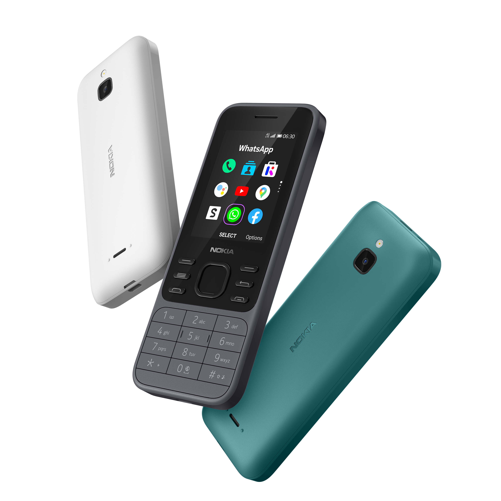

<p align="center">
  
</p>

### Table of Contents

- [Before making the decision](#before-making-the-decision)
- [Tips and tricks](#tips-and-tricks)
- [Known issues](#known-issues)
  - [KaiOS-specific](#kaios-specific)
- [Secret codes](#secret-codes)
- [Special boot modes](#special-boot-modes)
- [Sideloading and debugging third-party applications](#sideloading-and-debugging-third-party-applications)
- [ROOT: Boot partition patching (non-US only)](#root-boot-partition-patching-non-us-only)
  - [What we'll need](#what-well-need)
  - [Part 1: Set up environment for EDL tools](#part-1-set-up-environment-for-edl-tools)
    - [Linux](#linux)
    - [macOS](#macos)
    - [Windows](#windows)
  - [Part 2: Obtaining the boot partition](#part-2-obtaining-the-boot-partition)
    - [Nokia 8000 4G and Nokia 6300 4G with bkerler's EDL](#nokia-8000-4g-and-nokia-6300-4g-with-bkerlers-edl)
    - [Nokia 2720 Flip and Nokia 800 Tough with andybalholm's EDL](#nokia-2720-flip-and-nokia-800-tough-with-andybalholms-edl)
  - [Part 3: Patching the boot partition](#part-3-patching-the-boot-partition)
    - [Automatic patching with `8k-boot-patcher`](#automatic-patching-with-8k-boot-patcher)
    - [Manual patching with Android Image Kitchen](#manual-patching-with-android-image-kitchen)
  - [Part 4: Replacing the boot partition with patched one](#part-4-replacing-the-boot-partition-with-patched-one)
- [Source code](#source-code)
- [External links](#external-links)

|  |  |
| --- | --- |
| Codename | nokia-leo |
| Released | 13 November 2020 |
| Model | TA-1286, TA-1287, TA-1294, TA-1324 |
| ***Specifications*** |  |
| SoC | Qualcomm MSM8909 Snapdragon 210<br>(4 x 1.1Ghz Cortex-A7) |
| RAM | 512MB LPDDR2/3 |
| GPU | Adreno 304 |
| Storage | 4GB (+ up to 32GB microSDHC card) |
| Network | - 2G GSM<br>- 3G UMTS<br>- 4G LTE (Cat 4)<br>+ EU (except East Ukraine, Azerbaijan, Georgia), APAC: band 1, 3, 5, 7, 8, 20<br>+  MENA, CN, SSA: band 1, 3, 5, 7, 8, 20, 28, 38, 39, 40, 41<br>+ US: band 2, 4, 5, 12, 17, 66, 71<br>+ LATAM: band 2, 3, 4, 5, 7, 28<br>+ ROW: band 1, 3, 5, 7, 8, 20, 38, 40<br>- VoLTE & VoWiFi support<br>- Single or Dual SIM (Nano-SIM, dual-standby) |
| Screen | 320 x 240 (167 PPI)<br>2.4 inches QVGA TFT LCD, 16M colors |
| Bluetooth | 4.0, A2DP, LE |
| Wi-Fi | 802.11b/g/n, Hotspot |
| Peripherals | GPS |
| Cameras | Rear: VGA, LED flash |
| Dimensions<br>(H x W x D) | 131.4 * 53 * 13.7 (mm)<br>5.17 * 2.09 * 0.54 (in) |
| Weight | 104.7g (3.70oz) |
| Ports | - microUSB charging & USB 2.0 data transferring port<br>- 3.5mm headphone jack |
| Battery | Removable Li-Ion 1500mAh (BL-4XL) |
| ***KaiOS info*** |  |
| Version | KaiOS 2.5.4 |
| Build number | (TA-1286) 12.00.17.01, 20.00.17.01, 30.00.17.01 |

## Before making the decision

**BEWARE OF COUNTERFEIT DEVICES!** Many KaiOS devices, such as the Nokia 8110 4G, 2720 Flip and 6300 4G are being sold at numerous tech stores and online sites for amazingly cheap prices; those turned out to be counterfeits and did not bring the experiences that people expected, and the store gets away with it as you wouldn't be able to get a refund.

To spot out the counterfeits:

- Brand-new KaiOS devices, even after their lifespan on the shelf, DON'T cost less than 60% of their original prices.
- HMD/Nokia Mobile DON'T sell any of their KaiOS devices in 2G only. KaiOS devices are required to have at least 3G, as 2G is being phased out in many places.
- Different packaging: 8110 4G and 2720 Flip comes in transparent plastic boxes with flaps on top and bottom, while 6300 4G comes in hard cardboard box. Also check advertising prints on the box for missing features, bad quality printing, weird grammar or letter spacing.
- Terrible build quality when comparing side-by-side. [To quote u/cannotelaborate on Reddit](https://www.reddit.com/r/KaiOS/comments/xglkr7/well_darn_it_i_just_received_a_counterfeit_nokia):
  - Build quality is horrific, the battery and SIM cards barely fit in [their trays].
  - It takes only like 10 seconds to boot, shows KaiOS logo briefly, then plays the old Nokia chime.
  - Speaker quality is awful.
  - The buttons' faces are low quality and aren't flush with the overall surface, some of them are crooked as well.
- Remove the battery and look for suspicions with the printed information on the sticker, i.e. if the CODE is 23BTS70**VN**00, it is intended to sold in Vietnam only. You can also look for it in the OS by dialing *#0000#.
- If the user interface looks off with weird alignments and margins between elements, that's also a clue.
- Under all circumstances, all KaiOS 2.5 devices should have services like KaiStore installed by default.
- Browser is NOT Opera Mini 4.4. KaiOS does NOT run Java apps or MRE apps (sorry to retro gamers out there).
- If you have access to a computer, try connecting the phone to it and see if the actual phone storage is significantly less than advertised.

Remember, **only buy from trusted, reputable sources**, even if they have higher prices. That higher cost usually guarantees that you're buying a genuine device.

## Tips and tricks
- To take a screenshot, press both * and # keys simultaneously.
- On the home screen:
  - Hold down the Up key to quickly toggle flashlight.
  - Hold down either the Power button, Back or End call keys to trigger the Power menu.
  - Hold down 1 to listen to voicemails.
  - Hold down other number keys (2-9) to set up and activate Speed dial.
  - Hold down 0 to quickly open Browser.
  - Hold down * to quickly lock the phone.
  - Hold down # to toggle between Ringer and Vibrate mode.
- To activate the hidden Readout screen reader feature, open the phone's Browser, go to https://cyan-2048.github.io/kaios_scripts, then use the D-Pad to move the mouse and select the *Screen Reader* option.
- KaiOS accounts are NOT mandatory for the phone' operations or downloading apps from KaiStore, but they can be set up under *Settings > Accounts* if you need them anyways.

## Known issues
- RAM optimizations leading to aggressive background task killing. This can be mitigated by rooting the phone, then append this line in the startup script in /boot to disable the 'low memory killer' function. Don't forget to add a swapfile afterwards:
```
echo "0" > /sys/module/lowmemorykiller/parameters/enable_lmk
```
- Keypad recognizing double-presses instead of single-presses. This is due to the short keypress timeout interval in `keyboard.gaiamobile.org` and can be fixed by following this [BananaHackers' guide on fixing the keypad speed](https://ivan-hc.github.io/bananahackers/fix-the-keypad-speed.html)
- Battery draining heavily if you leave Wi-Fi on at all time. Try turning it off if you don't use it.
- Incorrect GPS on LTE. Not sure why, but you'll have to switch to 2G/3G for the phone to retrieve GPS information properly (*Settings > Mobile network & data > Carrier - SIMx > Network type > 3G/2G*)
- If you forgot your lockscreen passcode (not SIM or Anti-Theft one), you can bypass it by holding down the top Power button, then select *Memory Cleaner* and *Deep Memory Cleaning*.

### KaiOS-specific
- The 6300 4G runs KaiOS 2.5, which itself is based on Gecko 48 from 2016, meaning without optimizations and new web technologies, some websites like Instagram and Uber just fall apart and the overall performance is unbearable.
- D-Pad shortcuts and app shortcuts in the carousel menu (when you press Left on the home screen) are not customizable by default. *The former apparently has been allowed on KaiOS 3*, but to change them on this phone you'll have to change the homescreen launcher altogether.
  - Once you've sideloaded an alternative launcher, use Cyan's [Launcher Switcher](../main/Launcher_Switcher.zip) to switch to the new launcher.
- Text messages don't automatically convert to MMS in group chats. You'll have to add a message subject or file attachment before sending to manually do so, otherwise your message will be sent separately to each individual in the thread.
- Predictive typing mode doesn't last between inputs, meaning if you switch between input boxes, it'll return to the normal T9 mode.
- You cannot change message notification tone or alarm tone on the phone outside the defaults provided. This is because both are not managed by the system, but by the Messages and Clock app themselves.
  - To change them, you'll have to use ADB to pull the apps from `/system/b2g/webapps`, extract, edit the audio files and repackage the apps, then push them back under `/data/local/webapps` and edit the `basePath` in `/data/local/webapps/webapps.json` to reflect the change (see [BananaHackers' guide](https://ivan-hc.github.io/bananahackers/clock-alarms.html#h.unmy3yif91xs) for instructions)
- Alarms can be delayed if the Clock app is killed. Before going to sleep, make sure to open the Clock app and lock the phone without pressing the End call key and closing the app.
- Built-in email, calendar and contact syncing function with Google account may completely fail at times. Use IMAP and import contacts instead.
- Speaking of calendar, if you manage to sync your Google account with the phone, only the calendar *with your email address as its name* will sync.
- Apps like Contacts and Music are written in performance-intensive React and therefore render significantly slow if you store lots of contact entries and audio files.
- No built-in Widevine DRM decoders, which means the phone is NOT capable of playing DRM-protected content from e.g. Spotify

## Secret codes
- `*#*#33284*#*#`: Toggle debugging mode, allow the phone to be accessed with ADB and DevTools. A bug icon will appear in the status bar letting you know debugging mode is on. This mode can also be turned on under *Settings > Device > Developer > Debugger > ADB and DevTools*.
- `*#06#`: Display the IMEI(s).
- `*#0000#`: Display device information, such as firmware version, build date, model number, variant and CUID.

## Special boot modes
- **Recovery mode**: With the device powered off, hold the top Power button and the * key, or type `adb reboot recovery` when connected to a computer. Allows you to factory reset the device by wiping /data and /cache, view boot and kernel logs, and install patches from `adb sideload` interface or SD card.
- **EDL mode**: With the device powered off, hold the top Power button and both the * and # keys, or type `adb reboot edl` when connected to a computer. Boots into a black screen, allows you to read and write partitions in low-level with proprietary Qualcomm tools. Remove the battery to exit.

<details>
  <summary>What the heck is EDL mode?</summary>

---
**Qualcomm Emergency Download mode**, commonly known as EDL mode, is a special engineering interface implemented on devices with Qualcomm chipsets. Its purpose is to perform special operations on the phone that are intended for device manufacturer only, such as unlocking the bootloader, read and flash firmwares on the phone's filesystem or recover it from being a dead paperweight. Unlike bootloader or Fastboot mode, system files needed by the EDL mode resides on a separate 'primary bootloader' that cannot be affected by software modifications. 

Aleph Security has a deep-dive blog post into exploiting the nature of EDL mode on Qualcomm-chipset devices that you can read [here](https://alephsecurity.com/2018/01/22/qualcomm-edl-1).

Booting into this mode, the phone's screen will flash the 'enabled by KaiOS' logo momentarily, then turn almost black as if it's been turned off, but in fact it still receives commands over Qualcomm's proprietary protocol called Sahara (Firehose on newer devices). With a [suitable digitally-signed programmer in MBN/ELF file format](https://edl.bananahackers.net) and some instruction-bundled tools, the most popular one being QFIL (Qualcomm Flash Image Loader), one can send commands from a computer to the phone over USB.

---
</details>

You can also **force reboot** the phone by holding the top Power button and the # key at any time.

EDL loader for the international version of this phone (not TA-1324) can be found on BananaHackers' [EDL archive site](https://edl.bananahackers.net/loaders/8k.mbn) with hardware ID 0x009600e100420029 (a copy is available [here](../main/8k.mbn)). The US version of this phone has been signed with a different PK_HASH and needs a different firehose loader which we currently don't have in archive.

## Sideloading and debugging third-party applications
[A throughly-written guide covering sideloading and debugging apps on all KaiOS devices — including this phone — can be found here](/Sideloading_with_WebIDE.md).

According to BananaHackers' definitions, this phone and most other KaiOS 2.5.4 devices fall on the first category, meaning that you're allowed to sideload and debug third-party apps, with a few caveats: apps with 'forbidden' permissions such as `embed-apps`, `embed-widgets` and `engmode-extension` cannot be sideloaded, and pre-installed apps cannot be debugged using WebIDE's Developer Tools (you can, however, have a look at the system's global warnings and errors with `adb logcat`).

*Do note that OmniSD, one of the methods used for on-device sideloading, requires the `navigator.mozApps.mgmt.import` API that has been removed on KaiOS 2.5.2.2 and later.*

# ROOT: Boot partition patching (non-US only)
On the 6300 4G, 8000 4G and other KaiOS 2.5.4 devices, ADB and WebIDE can be used to sideload third-party applications. However, you won't be able to sideload apps that has ‘forbidden’ permissions (namely `engmode-extension` which can be used to gain exclusive access of the phone, and can be found in most BananaHackers-made apps like Wallace Toolbox) or make changes to the system. On the 2720 Flip and 800 Tough with KaiOS 2.5.2.2, the situation is worse as you aren't able to sideload at all. Because in order to achieve WhatsApp VoIP feature on these KaiOS versions, the security module SELinux is now set to be `Enforced` which checks and reverts system modifications on boot. To gain total read-write access to the devices, you'll now have to permanently root them by setting SELinux to `Permissive` mode.

The guide below has its backbones taken from the main guide on BananaHackers website, but has been rewritten for the most parts to be easier to follow. The process will also take somewhat considerable 30 minutes to an hour, so do this when you have the time.

*Note that for the most part, you don't actually need to gain root access in order to do some functions associated with root e.g. instead of completely removing apps with Wallace Toolbox, you can essentially disable them to be accessed from launcher with [this fork of Luxferre's AppBuster](https://github.com/minhduc-bui1/AppBuster). Luxferre also released a Wallace Toolbox alternative called [CrossTweak](https://gitlab.com/suborg/crosstweak) that does not require `engmode-extension` and therefore can be easily sideloaded on KaiOS 2.5.4 devices.*

**This process will void your phone's warranty, disable its ability to do WhatsApp calls and retrieve over-the-air updates, but you can revert this if you keep a backup of the original boot partition. However, there might also be a chance of bricking your phone if you don't do the steps correctly, so do think twice before actually consider doing this and follow the steps carefully! I won't be responsible for any damages done to your phone by following these.**

## What we'll need
- an international non-US version of Nokia 6300 4G (not TA-1324) or Nokia 8000 4G, Nokia 2720 Flip or Nokia 800 Tough;
- an USB cable capable of data transferring (EDL cables will also do);
- an Internet connection to download the tools needed;
- a somewhat-working firehose programmer MBN file for the [8000 4G and 6300 4G](../blob/main/8k.mbn), 2720 Flip or 800 Tough;
- an [image file of Gerda Recovery](..blob/main/recovery-8110.img) for the Nokia 8110 4G, since the firehose loader above has a reading bug, we'll use this to access ADB from the recovery mode and get the boot partition from there (not needed for 2720 Flip/800 Tough);
- a EDL tools package to read and write system partitions in low-level access (in this guide we'll be using [bkerler's edl.py v3.1](https://github.com/bkerler/edl/releases/tag/3.1) for 8000 4G/6300 4G, [andybalholm's edl](https://github.com/andybalholm/edl) for 2720 Flip/800 Tough)

*andybalholm's EDL cannot be used on 8000 4G and 6300 4G due to some structural changes within the GPT partition table, which will result in an error `AttributeError: 'gpt' object has no attribute 'partentries'. Did you mean: 'num_part_entries'?`. **Do note that the command structures used between bkerler's and andybalholm's are different, which we'll mention below.***

*We'll be using open-sourced Python scripts from GitHub for the sake of cross-platform usage (and my obsession of open-source tools), instead of QFIL which is proprietary and only supports Windows.*

- **Windows users also need:**
  - a computer with Python and `pip` installed for the EDL tools to work (Windows: both are packaged on Python's [official website](https://www.python.org/))
  - Qualcomm driver for your PC to detect the phone in EDL mode (included in the EDL tools)
  - [Zadig 2.7](https://github.com/pbatard/libwdi/releases/tag/v1.4.1) to configure `libusb-win32` driver
  - Android Debug Bridge (ADB) installed to read the boot image in Gerda Recovery (see [Development/WebIDE on BananaHackers Wiki](https://wiki.bananahackers.net/en/development/webide))

*@cyan-2048 confirmed to me that Zadig 2.5 bundled within the EDL package doesn't work, so **DO NOT USE** that. I've also specifically chosen version 2.7 as it works best throughout my testing, and the latest 2.8 version of Zadig tool also has troubles detecting the phone's EDL driver.*

- **macOS & Linux users also need:**
  - An package manager, such as [Homebrew](https://brew.sh), to quickly set up Python, ADB, `libusb` and configure the environment for EDL tools (setup guide with Homebrew can be found below)
  - *Python 2.7 bundled with macOS 10.8 to 12.3 is NOT recommended for following this guide.*

*If you're on Linux, Python and ADB can be quickly set up by installing with your built-in package manager. We won't be covering this here, as each Linux distro has its own way of installing from package manager.*

- **If you're going the automatic boot partition patching and compilation via Docker route (only recommended for 5-6 year old computers):**
  - Git to clone/download the repository of the patcher tool to your computer ([install guide](https://git-scm.com/book/en/v2/Getting-Started-Installing-Git))
  - Docker Compose to provide the environment for the patcher tool to work (included in Docker Desktop, whose download links can be found [here](https://docs.docker.com/compose/install))
  - (Windows) WSL 2 with [Linux kernel update package](https://learn.microsoft.com/en-us/windows/wsl/install-manual#step-4---download-the-linux-kernel-update-package) installed (to install WSL 2 turn on Virtualization in BIOS, then open Command Prompt with administrative rights and type `wsl --install`)

- **If you're going the extracting and manual editing by hand route:**
  - Android Image Kitchen v3.8 ([Windows](https://github.com/osm0sis/Android-Image-Kitchen), [macOS/Linux](https://forum.xda-developers.com/attachments/aik-linux-v3-8-all-tar-gz.5300923))
  - (Windows) [Notepad++](https://notepad-plus-plus.org/downloads) to edit the needed files while [preserving line endings](https://www.cs.toronto.edu/~krueger/csc209h/tut/line-endings.html)
  - [Java Runtime Environment](https://www.java.com/en/download) for properly signing the boot image (optional)

For the sake of simplicity, the guide assumes you've moved the Gerda Recovery image and the MBN loader file into the root of EDL tools folder, which you should do for convenience. If you'd like to have those in other folders, change the directory path accordingly.

## Part 1: Set up environment for EDL tools
> This portion of the guide was taken from [Development/EDL tools on BananaHackers Wiki](https://wiki.bananahackers.net/development/edl) so that you don't have to switch tabs. Kudos to Cyan for the guides!

### Linux
1. Install Python from your operating system's package manager e.g.
```console
sudo apt-get install python pip3
```
2. Then, open Terminal and type this to install the dependencies for EDL tools:
```console
sudo -H pip3 install pyusb pyserial capstone keystone-engine docopt
``` 
3. Switch your phone to EDL mode and connect it to your computer.
  - From the turned on state, turn on debugging mode on your phone by dialing `*#*#33284#*#*`, connect it to your computer and type `adb reboot edl` in a command-line window.
  - From the turned off state, hold down `*` and `#` at the same time while inserting the USB cable to the phone.

In both cases, the phone's screen should blink with a 'enabled by KaiOS' logo then become blank. This is normal behaviour letting you know you're in EDL mode and you can proceed.

Additionally, if you have issue with device access:

- Open `/etc/modprobe.d/blacklist.conf` in a text editor and append `blacklist qcserial`.
- Copy both `51-edl.rules` and `50-android.rules` in the root of extracted EDL tools folder to `/etc/udev/rules.d`.

### macOS
1. Follow the instructions to install Homebrew on [its homepage](https://brew.sh). Basically just open Terminal and copy the long streak of code shown on the page, and type your password when prompted.
2. While you're in Terminal, type this into the command-line:
```console
brew install python android-platform-tools libusb && pip3 install pyusb pyserial capstone keystone-engine docopt
```
3. Switch your phone to EDL mode and connect it to your computer.
  - From the turned on state, turn on debugging mode on your phone by dialing `*#*#33284#*#*`, connect it to your computer and type `adb reboot edl` in a command-line window.
  - From the turned off state, hold down `*` and `#` at the same time while inserting the USB cable to the phone.

### Windows
1. Open the Python installer and proceed with installation. Remember to tick the box next to "Add python.exe to PATH". This would make Python able to be called everywhere in the command-line instead of specifically pointing to its folder, which the next part of the guide won't cover on.


2. Open Command Prompt with administrator privileges and run this command:
```console
pip3 install pyusb pyserial capstone keystone-engine docopt
```


3. Open the extracted EDL tools folder, go to the Drivers > Windows folder and run `Qualcomm_Diag_QD_Loader_2016_driver.exe` with administrator rights. Proceed with installation and leave everything as default, restart the computer if it prompts you to do so.


4. Switch your phone to EDL mode and connect it to your computer.
  - From the turned on state, turn on debugging mode on your phone by dialing `*#*#33284#*#*`, connect it to your computer and type `adb reboot edl` in a command-line window.
  - From the turned off state, hold down `*` and `#` at the same time while inserting the USB cable to the phone.

In both cases, the phone's screen should blink with a 'enabled by KaiOS' logo then become blank. This is normal behaviour letting you know you're in EDL mode and you can proceed.

5. Run the Zadig tool (use the version downloaded above and NOT the one provided by the EDL package) and select *Options > List All Devices*. In the front dropdown menu, select `QHSUSB__BULK` (your device in EDL mode). In the target driver box (which the green arrow is pointing to), click on the up/down arrows until you see `libusb-win32` and click on Replace Driver.


6. If you're installing the driver for the first time, an "USB Device Not Recognised" pop-up may appear. Exit EDL mode by removing and re-inserting the battery, then turn on the phone in EDL mode again.

*As I've said above, the latest 2.8 version of Zadig might have some troubles detecting the phone's EDL driver. If you were using it and the driver installation takes too much time and the tool aborts it, exit Zadig, exit and re-enter EDL mode on the phone, then try to install again. If that still doesn't help, try to [download version 2.7](https://github.com/pbatard/libwdi/releases/tag/v1.4.1) instead.*

## Part 2: Obtaining the boot partition

### Nokia 8000 4G and Nokia 6300 4G with bkerler's EDL
> Beware: due to the firehose loader being malfunctioned, the EDL tool only accepts one command each session, after which you'll have to disconnect the phone and restart the phone in EDL mode. If you try to throw a second command, it'll result in a `bytearray index out of range` error.

1. Turn on the phone in EDL mode.

2. Open the EDL tools folder in a command-line window. Flash the Gerda Recovery image to the recovery partition by typing this command:
```console
python3 edl.py w recovery recovery-8110.img --loader=8k.mbn
```
*If the progress bar stops at 99% and you get this error `'usb.core.USBError: [Errno None] b'libusb0-dll:err [_usb_reap_async] timeout error\n'` or `usb.core.USBError: [Errno 60] Command timed out`, don't panic! This is because the phone doesn't send any indicator information back to the EDL tool when in fact the image has been successfully written. Don't mind the error and proceed with the next step.*

3. When finished, disconnect the phone from your computer and exit EDL mode by removing and re-inserting the battery. 

4. Then, hold down the top Power button and `*` to turn on the phone in recovery mode. Connect the phone to your computer again.  

**Be careful not to boot into normal operation mode at this point! As stated above, while SELinux is still in `Enforced` mode, it'll try to revert all system modifications on startup, in this case, the custom recovery image we've just flashed will be overwritten by the stock one. If you accidentally start into normal mode (with the Nokia logo), you'll have to start over from step 1.**

Don't worry if this boots into a white screen, you can still use ADB right after boot. This is because the display driver for the Nokia 8110 4G included in the recovery image are not compatible with the display of 8000 4G/6300 4G.

Check if ADB can recognise the phone by typing `adb devices` into the command-line.

5. Navigate the command-line to the `platform-tools` folder (if needed) and pull the boot image from the phone by typing this command:
```console
adb pull /dev/block/bootdevice/by-name/boot boot.img
```
You should now see `/dev/block/bootdevice/by-name/boot: 1 file pulled, 0 skipped.` and have a copy of the boot partition with the size of 32.0MB (32,768KB). Fetched boot image will be saved to the current directory.

6. Reboot the phone into normal operation by typing `adb reboot` into the command-line, or remove and re-insert the battery. Our custom Gerda Recovery partition will now be overwritten by the default one.

You can disconnect the phone from your computer for now.

**Copy and keep the original boot partition somewhere safe in case you need to restore to the original state for over-the-air updates or re-enabling WhatsApp calls.**

### Nokia 2720 Flip and Nokia 800 Tough with andybalholm's EDL
Unlike the 6300 4G and 8000 4G, our phones' EDL loader properly works with both reading and writing, so the steps are more straightforward.

1. Switch your phone to EDL mode and connect it to your computer.
  - From the turned on state, turn on debugging mode on your phone by dialing `*#*#33284#*#*`, connect it to your computer and type `adb reboot edl` in a command-line window.
  - From the turned off state, hold down both side volume keys (2720 Flip) or both D-Pad Up and Down keys (800 Tough) at the same time while inserting the USB cable to the phone.

In both cases, the phone's screen should blink with a 'Powered by KaiOS' logo then become blank. This is normal behaviour letting you know you're in EDL mode and you can proceed.

2. Open the EDL tools folder in a command-line window. Extract the boot partition of the phone by typing one of these commands depend on which file you have:
```console
python edl.py -r boot boot.img -loader 2720.mbn
```
```console
python edl.py -r boot boot.img -loader 800t.mbn
```
3. When finished, reboot the phone into normal operation by typing one of these into the command-line, or remove and re-insert the battery:
```console
python edl.py -reset -loader 2720.mbn
```
```console
python edl.py -reset -loader 800t.mbn
```
You can disconnect the phone from your computer for now.

**Copy and keep the original boot partition somewhere safe in case you need to restore to the original state for over-the-air updates or re-enabling WhatsApp calls.**

## Part 3: Patching the boot partition
### Automatic patching with `8k-boot-patcher`
1. Follow Docker's tutorial on installing Docker Desktop. Once set up, open the program, click Accept on this box and let the Docker Engine start before exiting.


2. Clone/download the boot patcher toolkit by typing this into a command-line window. This will download the toolkit and have Docker set it up. Do not omit the dot/period at the end of this command, this tells Docker where our downloaded toolkit are located on the system.
```console
git clone https://gitlab.com/suborg/8k-boot-patcher.git && cd 8k-boot-patcher && docker build -t 8kbootpatcher .
```


3. Copy the `boot.img` file we've just pulled from our phone to the desktop and do not change its name. Type this into the command-line to run the patching process:
```console
docker run --rm -it -v ~/Desktop:/image 8kbootpatcher
```


That's it! On your desktop there will be two new image files, the patched `boot.img` and the original `boot-orig.img`. You can now head to part 4.


### Manual patching with Android Image Kitchen

1. Open the extracted Android Image Kitchen tools folder and copy the boot image we've just obtained over to the root of it.


2. Open the folder in a command-line window and type `unpackimg boot.img`. This will split the image file and unpack the ramdisk to their subdirectories.


**Be sure to edit the files correctly, else the phone won't boot!**

3. Let the editing begin! First, open `ramdisk/default.prop` using Notepad++ and change:

- line 7: `ro.secure=1` -> `ro.secure=0`
- line 8: `security.perf_harden=1` -> `security.perf_harden=0`
- line 10: `ro.debuggable=0` -> `ro.debuggable=1`


4. Open `ramdisk/init.qcom.early_boot.sh` in Notepad++ and add `setenforce 0` as a new line at the end of the file.


5. Go back to the root Android Image Kitchen folder and open `boot.img-cmdline` in Notepad++. Scroll to the end of the line and append `androidboot.selinux=permissive enforcing=0` at the end of it without adding a new line.


6. Open `ramdisk/init.rc` (NOT `ramdisk/init`) and delete the reference of `setprop selinux.reload_policy 1` at line 393. This will ultimately prevent SELinux from overwriting the policy changes we made above. 


7. And that's a wrap! Open the root Android Image Kitchen folder in a command-line window and type `repackimg` to package our patched boot partition.


*If you happen to encounter an error during the signing process, that's likely because the process uses `java` to power the `boot-signer.jar` sequence and you don't have it installed. The image will still be packaged and ready for flashing, but if you're a perfectionist, you can install JRE and try again.*


If the newly packaged image is barely over 1/3 the size of the original image, it's a normal behaviour and you can proceed.

## Part 4: Replacing the boot partition with patched one

1. Turn on your phone in EDL mode and connect it to your computer.

2. Move the newly created `boot.img`, `unsigned-new.img` or `image-new.img` to the EDL tools folder and open a command-line window within it. From here type either of these commands depending on which image file you have:
```console
python edl.py w boot boot.img --loader=8k.mbn
```
OR
```console
python edl.py w boot unsigned-new.img --loader=8k.mbn
```
OR
```console
python edl.py w boot image-new.img --loader=8k.mbn
```
For Nokia 2720 Flip and Nokia 800 Tough with andybalholm's EDL:
```console
python edl.py -w boot boot.img -loader 2720.mbn
```
```console
python edl.py -w boot boot.img -loader 800t.mbn
```

*Again, if the progress bar stops at 99% and you get a timeout error, this is because the phone doesn't send any indicator information back to the EDL tool when in fact the image has been successfully written. Don't mind the error and go on with the next step.*

3. Restart the phone to normal operation mode: `python edl.py reset`. And we're done!

*If you still have the original boot partition and wish to revert all the messes and damages, connect the phone to your computer in EDL mode, move the image file to the EDL tools folder, open a command-line window within it and type these one-line at a time:*
```console
python edl.py w boot boot.img --loader=8k.mbn
python edl.py reset
```


## Source code

HMD Global/Nokia Mobile has published the device's source code for its Linux 4.9 kernel, B2G and certain third-party libraries used in this phone, which can be downloaded directly from [here](https://nokiaphones-opensource.azureedge.net/download/phones/Nokia_6300_4G_20.00.17.01_OSS.tar.gz). An archive of which is also available under the `leo-v20` branch of this repository.

Note that the source code released does not contain proprietary parts from other parties like Qualcomm.

## External links

- [Nokia 6300 4G product page](https://www.nokia.com/phones/en_int/nokia-6300-4g) on Nokia Mobile's website
- [Nokia 6300 4G (nokia-leo) on postmarketOS Wiki](https://wiki.postmarketos.org/wiki/Nokia_6300_4G_(nokia-leo))
- [Affe Null's Bananian project repository](https://git.abscue.de/bananian/bananian), a Debian port for KaiOS devices
