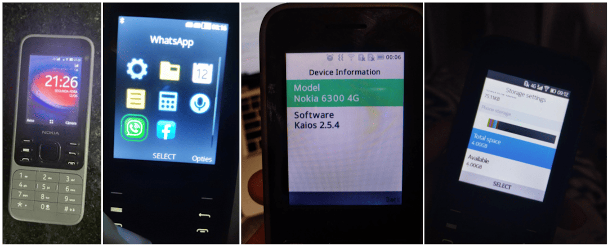
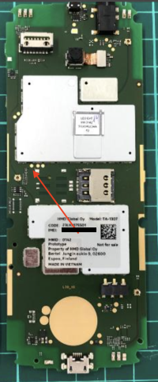



*Source code [provided by HMD] for B2G, Linux 4.9 kernel and certain LGPL-2.1 licensed libraries used on the 6300 4G can be found in [`leo-v20` branch of this repository]. Note that it doesn't contain proprietary code from third parties and thus cannot be used to compile a fully working KaiOS firmware.*

	<picture class="header">
		<source media="(max-width:800px)" srcset="assets/img/0x00-600.webp" type="image/webp">
		<source srcset="assets/img/0x00-3000.webp" type="image/webp">
		
	</picture>

**Table of Contents**
- [Don't buy a counterfeit](#dont-buy-a-counterfeit)
	- [About Kosher phones](#about-kosher-phones)
- [Differences between US and international variants](#differences-between-us-and-international-variants)
- [Tips and tricks](#tips-and-tricks)
- [Known issues](#known-issues)
	- [KaiOS-specific](#kaios-specific)
- [Secret codes](#secret-codes)
- [Special boot modes](#special-boot-modes)
	- [UART debugging testpoint](#uart-debugging-testpoint)
- [Sideloading and debugging third-party applications](#sideloading-and-debugging-third-party-applications)
- [External links](#external-links)

In late 2020, as people need to stay connected amid the height of the [COVID-19 pandemic], HMD Global quietly introduced the new Nokia 6300 4G with KaiOS 2.5.4. Following the successful relaunch of the Nokia-branded retros 2720 Flip and 800 Tough, the 6300 4G packs a bunch of modern features, such as 4G LTE, Wi-Fi and social apps like WhatsApp and Facebook into a pocket-friendly design, whilst inheriting the classic candy-bar look of the original Nokia 6300. It was [one of the most affordable] the company has ever offered in its KaiOS lineup, at €49/$69.99, though still pricier than the general KaiOS devices. Since then, the phone has gained popularity and also mixed reviews from the community, notably on its performance and keypad typing experience.

I decided to get an used 6300 4G in mid-May 2022, despite already having the 2720 Flip and Cyan's advise against buying another phone. Nevertheless, this drew me further into the rabbit hole of KaiOS; the more compact design, vibrant screen, and the balance kept between being [fully-featured yet still developer-friendly] on the phone really striked me. This inspired me into documenting this as a result of my almost 2-year experience with it.

## Don't buy a counterfeit
Here's the funny thing: it's easier to get a genuine version of the original Nokia 6300 than its rebranded version. On eBay, Shopee and [other online shopping sites] across North America, Europe and Southeast Asia, you may see hundreds of listings of used 6300 4G in various conditions. While the listings seem to look identical, many of those are NOT genuine but are knock-offs with [terrible build quality] and user experience. Do note that:
- Brand-new KaiOS phones, even when off the shelves, don't cost less than 2/3 of their retail prices.
- HMD has [never sold 2G-only version of any of its KaiOS devices] in its official capacity. All KaiOS phones from HMD are well-equipped with 4G LTE, Wi-Fi and Bluetooth. KaiOS devices are required to have 3G at minimum.
- If the seller only uploaded generic photos showing the phone's exterior, ask for some additional photos of the box it came in. A genuine phone's box would show all its features on the fine print, as well as an information sticker indicating its model number (which matches the device specification table above) and targeted regional market. Note: Check the model number on the packaging box with that on another information sticker under the battery, and when dialing `*#0000#` in the operating system!
- Look for signs of the phone running KaiOS and not MRE: KaiOS uses the distinct [Open Sans UI font] and vibrant, properly aligned UI elements. KaiStore and related services should be available at all time. It does NOT natively run Opera Mini 4.4 or other Java/MRE apps.

*Photos provided by [thurmendes on r/KaiOS Discord server] in June 2023 and various Reddit posts ([second], [third], [fourth]).*

### About Kosher phones
Kosher is a category of devices whose software (sometimes hardware) is heavily modified to limit access, or even get rid of content and features deemed distracting or against religious values, while keeping other features and user interface almost identical to the original. Companies specializing in customizing Kosher phones exist, and you can easily come across Kosher phone listings on eBay advertising as productivity and focus improvement tools.

As the build and UI remain identical, it's difficult to tell Kosher phones and genuine ones apart. As of now, my key takeaways to differentiate them are:
- there might be logos embedded on hardware and/or splash screen displayed on the boot sequence to indicate a Kosher phone (original only shows 'enabled by KaiOS' followed by the Nokia logo and chime);
- Browser, KaiStore and other bloat games are missing even if you have an active cellular service; links in Messages don't work; options to manage KaiOS accounts in Settings are greyed out (depending on each variant, WhatsApp and APIs it relies on might go missing or be intentionally left in);
- no options to toggle ADB and DevTools access: dialing `*#*#debug#*#*` triggers nothing; cannot boot into Recovery mode; getting access to EDL mode varies

Kosher is indeed a great way to make your phone truly basic, but HMD already offers more basic phones with 4G in their feature phone lineup, so the choice is yours. **Double-check the description and pictures of the listings before you buy.**

*Photo provided by nuxx on r/KaiOS Discord server in October 2021.*

## Differences between US and international variants
"Buying Western-customized products will always give you the best quality possible" is unwise when it comes to consumer electronics, including mobile phones, and the 6300 4G is no exception. When buying the TA-1324 variant of this phone, you should expect:
- No cellular access: From the dawn of mobile phone technologies, for national security, the US has been using different cellular technologies from the rest of the world with little to no compatibility. On 4G LTE, the US variant receives different bands with little overlaps on international variants' bands, primarily band 7 (see the device specification table above). This means that you will have trouble making or receiving calls and texts on the US variant outside the country without roaming.
- Restricted device settings, notably device and T9 languages, as the phone software has to follow the FCC's regulations. On the US 6300 4G, the only languages available are English (US), español (US), Français (CA) and Português (BR).
- Tighten device security: US 6300 4G currently cannot be rooted due to different hash signature used for EDL handshake (see [Sideloading and debugging third-party applications] below).

Don't buy the US variant of 6300 4G unless you know what you're doing. Seek the availability of the phone in the closest place or nearby countries to where you are.

## Tips and tricks
- You can capture a screenshot by pressing both * and # keys at the same time.
- For tactile responses on keypresses, turn on *Keypad vibration* under *Settings → Device → Accessibility*.
- You don’t need a KaiOS account to use your phone or download apps from KaiStore, but you can create one in Settings, Accounts if you want to use Anti-Theft features.
- To stop getting ad notifications from KaiStore, go to *Settings → Personalization → Notices → App notices → Store* and turn off *Allow Notices*. Then go to *Store → Options → Settings & Account → Show rich content* and select *Do not show*.
	- To block KaiAds altogether, add `ssp.kaiads.com` in your Wi-Fi routers' blacklist or [the system's `hosts` file]. Be aware that this might prevent you from installing apps from KaiStore like WhatsApp.
- Speed Dial lets you call a contact quickly by pressing and holding a number key from 2 to 9 on the homescreen. To assign a contact to a number key, press and hold an empty key on the homescreen or go to *Contacts → Options → Settings → Set Speed Dial Contacts*. You can also change your voicemail number in the same menu.
	- *ICE (In Case of Emergency) Contacts, however, is an useless feature on this phone, since there's basically no way to activate it. On the 2720 Flip, you could hold or double-press the side button to trigger SOS Call.*
- You can use a GIF as your homescreen wallpaper, but it will drain your battery faster.
- If you prefer a different layout than the default 3-by-3 grid view, you can choose *Options → List view/Single view* and rearrange the items as you like.
- Readout is a hidden accessibility feature for blind and visually-impaired users, which reads the focused content on your screen and your selection out loud. To toggle Readout, turn on debugging mode on the phone and connect it to a WebIDE session (see [Sideloading and debugging third-party applications]), then toggle the `accessibility.screenreader` Device Settings boolean flag.
	- Note that this feature might not work well with some third-party apps which have unlabelled buttons.

## Known issues
- While HMD claimed the shell as being made from "durable" polycarbonate and glossy plastic finish, I quickly discovered that the phone is susceptible to scratches if you're not careful. Not as serious as the plastic back panel of the 2720 Flip, but consider getting a protective case for peace of mind.
- Be gentle when opening the back panel: if you open it too often or put too much force, the clips holding the panel might be stressed and quickly break.
	- *Note that phone shutting itself down or not receiving any power usually come down to loose or dirty battery connectors or charging port, and not software problem. Happened to me once, got the phone repaired for less than $10.*
- Decent speaker, but can be muffled on strong bass. Audiophiles look elsewhere; while this phone has a 3.5mm headphone jack and supports playing FLAC files though third-party audio players, it isn't a direct Sony Walkman replacement.
- Keypad frequently registers multiple or no keypresses instead of single ones, partly due to the small keypad design with only enough space for fingernails, and keypress timeout interval in `keyboard.gaiamobile.org` being too short. [BananaHackers' guide on fixing the keypad speed] may help
- Battery drains quickly (from 3–5 days of 4G standby to about 18 hours, or 2 hours in active usage) if you leave Wi-Fi or mobile data on, e.g. to be notified of incoming WhatsApp messages. Turn them off if you don't plan to use Internet connection, and turn them on periodically to check for notifications.
- A-GPS fails to lock your current position on 4G LTE, possibly due to interferences with TDD bands. A workaround is to switch to 2G/3G to get GPS signal: *Settings → Mobile network & data → Carrier - SIMx → Network type → 3G/2G*. Might be major issue for those in the US where 2G/3G has been shut down.
- RAM optimizations leading to the phone joining Doze deep sleep and aggressive background task killing after a few minutes, making opening or exiting apps horribly slow, and notifications—including incoming WhatsApp calls—being delayed.
	- Wi-Fi hotspot will also stop transmitting data packets with your other devices when you put the phone into sleep. *As a workaround, you can have [a playlist of silent MP3s played in background] to prevent the phone from Doze sleep.*
	- *This can be permanently mitigated by modifying startup scripts in /boot to disable the Low Memory Killer module, which will be mentioned in [Manual patching with Android Image Kitchen] below.*
- Predictive typing mode doesn't last between inputs, meaning if you switch between input boxes, it'll return to the normal T9 mode. To override this, modify `keypad.js` in `keyboard.gaiamobile.org`, set `this.isT9Enabled=true` and priotise T9 in the typing mode list (kudos to [mrkisl in r/KaiOS Discord server])
- On certain network providers where this phone isn't yet certified, such as Jio Reliance in India, you might [temporarily mute yourself on phone calls with VoLTE/VoWiFi enabled]. Putting yourself on hold and off does ease the problem.
- Normally, you can wake up the phone from sleep by either pressing the Power, Volume up or Volume down buttons, regardless of whether lock screen is in place or not. On this phone there are no volume buttons, but some of their functions, such as triggering boot modes or waking the phone up, are mapped to * and # respectively. This can be problematic as those keys are located close to the bottom edge of the phone and can be randomly mashed if you store the phone in your front pockets, leading to [unintended screenshots].
- If you forgot your lockscreen passcode (not SIM or Anti-Theft ones), you can [bypass it] by holding down the top Power button, then select *Memory Cleaner → Deep Memory Cleaning*.
- *According to reports from GSMArena and Reddit, some call and text entries may not be registered in the log. I haven't been able to replicate this during my usage however, could be related to other mentioned issues.*

### KaiOS-specific
- If you're setting up the phone for the first time with no SIM card, pre-installed apps such as WhatsApp, Facebook and Google apps may not appear in the app list or in KaiStore. After popping in a SIM, those apps will show up as normal.
	- *KaiStore will show up in all circumstances, regardless of whether there's a SIM card inserted or not.*
- WhatsApp: Upon getting the confirmation code needed to set up, you may be indefinitely stuck at Connecting WhatsApp... regardless of whether you're on Wi-Fi/mobile data or had a SIM in. Some suggested that pre-configuration files seem to have caused the issue and, in most cases, can be fixed with a factory reset.
	- *[Temporarily putting your SIM in another phone to receive the code] may help as well.*
- Since this phone features outdated Gecko 48.0a1 from 2016, without optimizations and new web technologies, some websites like Instagram and Uber refuse to load and the overall performance is unbearable. *Performance issues have been addressed on later versions, with the use of new Gecko, Gonk layer, ECMAScript 2021 and modern features like WebRender.*
	- Built-in apps, such as Call logs, Contacts or Music, are written in performance-intensive React and not optimized, causing slow rendering and system lags if you store a large number of contacts, call logs, audio files or other items in a list.
	- *If you're a developer, check out Tom Barrasso's KaiOS.dev blog post [KaiOS App Optimization Tips].*
- No built-in Widevine DRM decoders, which means the phone is NOT capable of playing DRM-protected content from e.g. Spotify
- Sending text messages don't automatically convert to MMS in group chats. You'll have to add a message subject or file attachment before sending to manually do so, otherwise your message will be sent separately to each individual in the thread. Receiving works flawlessly. *Group messaging over MMS has been properly implemented as a feature on later versions.*
- If the Clock app is killed, alarms might be delayed, unable to go off or go off unexpectedly at the wrong time, even when the system clock is set correctly. Before going to bed, keep the Clock app on by locking the phone or closing the app only with the Back key AND not the End call key.
	- For context, alarms set in the Clock app and some app notifications use the system in-built Alarm API, which should be always active in the background and not rely on whether the application itself was closed or not. But for some unknown reasons—likely due to optimisation issues, see above—the API does not run at the registered time. *TODO: connect the phone to a computer, run `adb logcat` and read through the system logs!*
	- *If you're a developer, alternatives to Alarm API can be found on Tom Barrasso's KaiOS.dev blog post [Running in the Background on KaiOS].*
- Photos larger than 6000-by-4000 in size cannot be opened in the Gallery app due to restrictions in place preventing memory constraints. As a workaround, you can download [FabianOvrWrt's Explorer] and [mochaSoft Aps' Photo Zoom] from KaiStore to view them instead.
- Built-in File Manager app doesn't show folders in the internal storage other than pre-configured ones (audio, music, photos, books, videos, DCIM, downloads, others). This is [hardcoded within its code] as a measure to hide system files (such as DIC files for storing added T9 words), but can be easily misused. *To browse the entire internal storage, use third-party file managers from KaiStore, or turn on Settings → Storage → USB Storage and connect to a computer.*
- Built-in email, calendar and contact syncing with Google account may completely fail at times. You should use IMAP and import contacts instead.
	- In December 2021, in order to [replace the expired Let's Encrypt root certificate DST Root CA X3 with the newer ISRG Root X1], KaiOS Technologies issued a Service Update via KaiStore to all active KaiOS devices. This caused the Contacts app on some phones, notably HMD/Nokia KaiOS phones and Alcatel MyFlip 2, to [freeze on open]. In some cases, apps such as E-Mail, Calendar and Settings freezed as well, and Google accounts configured in the Settings app couldn't be removed. As a fix, people were advised to factory reset their affected devices. See [openGiraffe's guide to properly update the certificates]
	- *If you miss T9 fuzzy search in Contacts app, there's a port called [FastContact] by Luxferre that you can sideload to use as an alternative.*
	- E-Mail app lacks many crucial enterprise features, such as OAuth2 secure sign-in.
	- Speaking of built-in Calendar app, if you manage to sync your Google account with the phone, only the calendar *with your email address as its name* will sync.
- Pairing with certain Bluetooth devices, such as car stereos, may fail on authentication process.
	- KaiOS does not support Bluetooth input accessories like keyboards and mices. If you were to pair them, they would be recognised as regular Bluetooth devices but the OS would not accept any input.
- You cannot change message alert tone or alarm tone on the phone other than the defaults provided. This is because both are not managed by the system, but by the Messages and Clock app themselves. To change them, you'll have to use ADB to pull `sms.gaiamobile.org` and `clock.gaiamobile.org` from `/system/b2g/webapps`, extract, edit the audio files and repackage the apps, then push them back under `/data/local/webapps` and edit the `basePath` in `/data/local/webapps/webapps.json` to reflect the change (see [BananaHackers' guide] for instructions)
- D-Pad shortcuts and app shortcuts in the carousel menu (when you press Left on the home screen) are not customizable. *The former has been addressed on later versions*, but to change them on this phone you'll have to edit `launcher.gaiamobile.org`.

## Secret codes
*Tip: You can save these codes as contacts to dial later or as Speed Dial entries. When the phone suggests a saved code, you can press Call to activate the code's function.*
- `*#*#33284#*#*` (`*#*#debug#*#*`): Toggle debugging mode, allowing the phone to be debugged over ADB and DevTools (see [Sideloading and debugging/WebIDE]). A bug icon will appear in the status bar letting you know debugging mode is on. This can also be turned on under *Settings → Device → Developer → Debugger → ADB and DevTools*.
- `*#06#`: View the 15-digit [International Mobile Equipment Identity numbers] or IMEI(s) to uniquely identify a specific cell phone on GSM networks. **Do not modify, delete or show these numbers to anyone else without taking any precautions**: invalid or duplicated IMEI(s) will prevent you from receiving cellular signals or even get you into legal issues.
- `*#0606#` (TA-1324 only): View the 14-digit [Mobile Equipment Identifier numbers] or MEID(s) to uniquely identify a specific cell phone on CDMA networks. Note that this only applies to US models; on international models the MEIDs would be invalid (all zeroes) and thus this secret code does nothing.
- `*#0000#`: View device information, including firmware version, build date, model number, regional variant and CUID.
- `*#33#` (call): Check the [Call barring] service status from carrier for blocking or whitelisting calls, whether incoming or outgoing, domestic or international. Requires a 4-digit passcode to use. To toggle, go to *Settings → Network & Connectivity → Calling → Call barring*.
- `*#43#` (call): Check the [Call waiting] service status from carrier. To toggle, go to *Settings → Network & Connectivity → Calling → Call waiting*.
- `*#*#372733#*#*` (`*#*#draped#*#*`): Open KaiOS MMI Test, an internal tool to test each hardware component of a KaiOS device. Tests can be done through an automatic routine or by hand, and include LCD backlight, T9 keyboard, camera, LED flash, RTC, speaker, microphone, vibrator, 3.5mm audio jack, SIM trays, Wi-Fi, Bluetooth, NFC, microSD and microUSB slots.
	- Throughout the manual speaker test, you'll hear some English and Chinese dialog from a female speaker, which transcribes to: *Hello. Please dial 110 for police, 119 for fire, 120 for ambulance, 122 for traffic accidents, and dial area code before 112 for six full obstacles.* [?]

### Codes that don't work
Most of these codes requires `userdebug` or `eng` versions to work.
- `*#07#`: Check the `ro.sar.enabled` boolean property, if true check the current SAR level and display SAR-related health and safety information.
- `*#1219#`: Clear all userspace customizations, presumably for store display.
- `*#091#` (on)/`*#092#` (off): Toggle auto-answering on incoming call. You can turn this on under Device Settings in WebIDE.
- `*#2886#` (`*#auto#`): Should also open KaiOS MMI Test interface.
- `*#8378269#` (`*#testbox#`)/`*#*#2637643#*#*` (`*#*#android#*#*`): Open Testbox engineering menu with predecessor Firefox OS design, previously used by OEMs to test hardware components. This menu can be manually opened using [Luxferre's CrossTweak].
- `###2324#` (`###adbg#`): Open a menu, allowing to toggle Qualcomm diagnostic mode for fixing null/invalid IMEI or baseband via QPST.
- `*#*#212018#*#*`: Toggle privileged access (including rooted ADB shell) to the phone.
- `*#7223#` (`*#race#`): Display internal firmware build and boot image versions.
- `*#*#0574#*#*` (`*#*#0lri#*#*`): Open LogManager utility which allows you to fully enable ADB and DevTools on Spreadtrum devices.
- `*#573564#` (`*#jrdlog#`): Open T2M Log (jrdlog), a stripped-down LogManager interface.
- `*#1314#`: Switch the `auto.send.crash.sms` property, whose purpose is still unknown.

## Special boot modes
- **Recovery mode**: With the device powered off, hold the top Power button and the * key, or type `adb reboot recovery` when connected to a computer. Allows you to factory reset the device by wiping /data and /cache, view boot and kernel logs, and install patches from `adb sideload` interface or SD card.
- **Fastboot mode**: Only accessible and automatically kick in when both /boot and /recovery is corrupted. Allows you to restore partitions under `fastboot` interface.
- **EDL mode**: With the device powered off, hold the top Power button and both the * and # keys, or type `adb reboot edl` when connected to a computer. Boots into a black screen, allows you to read and write partitions in low-level with proprietary Qualcomm tools. Remove the battery to exit.

What the heck is EDL mode?

**Qualcomm Emergency Download mode**, commonly known as EDL mode, is a special engineering interface implemented on devices with Qualcomm chipsets. It lets you do special operations on the phone that only the device manufacturer can do, such as unlocking the bootloader, read and write firmwares on the phone's filesystem or recover from being a dead paperweight. Unlike bootloader or Fastboot mode, system files needed by the EDL mode resides on a separate 'primary bootloader' that aren't affected by software modifications.[^3]

Booting into this mode, the phone's screen will briefly show the 'enabled by KaiOS' logo, then turn almost black as if it's off, but in fact it's still listening to commands over Qualcomm's proprietary protocol called Sahara (or Firehose on newer devices). With a [suitable digitally-signed programmer in MBN/ELF file format] and some instruction-bundled tools, the most popular one being QFIL (Qualcomm Flash Image Loader), one can send commands from a computer to the phone over USB.

You can also **force reboot** the phone by holding the top Power button and the # key at any time.

EDL programmer for the international version of this phone (not TA-1324) can be found on BananaHackers' [EDL archive site] with hardware ID 0x009600e100420029 (a copy is available in the content of this repository). TA-1324 version of this phone has been signed with a different PK_HASH and needs a different firehose loader which we currently don't have in archive.

### UART debugging testpoint
[As discovered by atipls on Discord and @Llixuma], on the mainboard of the 6300 4G, there are 3 UART testing points in the order of TX, RX and GND just above the SIM2 slot. Shorting TX at 1.8V and GND takes you to Fastboot and Linux terminal interface.

Note that by default, KaiOS kernel disables the UART testpoints; kernel logs from UART testpoints will stop once the Linux kernel kicks in. To read the full output from UART, compile the Linux kernel from OSS release [provided by HMD]—also available under [`leo-v20` branch of this repository]—with `LEO_defconfig` flag (not `LEO_defconfig-perf`).

## Sideloading and debugging third-party applications
Don't want to download apps from KaiStore? Both the 6300 4G and 8000 4G have been classified as debug-enabled by the BananaHackers team. As with other KaiOS 2.5.4 devices, you can install and debug apps from outside sources on these phones, so long as they don't use 'forbidden' permissions, such as `engmode-extension`, `embed-apps` and `embed-widgets`, and you cannot debug pre-installed apps on the phone using WebIDE's Developer Tools (you're free to use `adb logcat` to view system logs instead).

Detailed instructions can be found at [Sideloading and debugging/WebIDE]. Feel free to check out apps made by the community on [BananaHackers Store], old [B-Hackers Store] and my personally curated [list of KaiOS apps].

**Do note that OmniSD, one of the methods used for on-device sideloading, and many Gerda-related apps requires the `navigator.mozApps.mgmt.import` API that has been removed from KaiOS 2.5.2.2, and therefore no longer work on this phone.** However, after permanently rooting the phone, the Privileged factory reset feature to gain privileged userspace session that could be used on KaiOS 2.5.2 and older can now be used again (see [Next steps]).

To remove unwanted apps from the phone, you can use [this fork of Luxferre's AppBuster] which lets you disable any apps you don't need and enable them again if you want.

> Looking for guide to root the 6300 4G? This section has now been moved to [ROOT: Patching the boot partition (non-US only)].

## External links
- [Nokia 6300 4G product page] on Nokia Mobile's website
- [Nokia 8000 4G product page] on Nokia Mobile's website
- [Nokia 6300 4G review] by PC Magazine
- [Discussion: Nokia 6300 4G and Nokia 8000 4G] on 4PDA Forum (Russian)
- [Nokia 8000 4G and Nokia 6300 4G general discussion thread] on BananaHackers Google Groups
- [Nokia 8000 4G rooting research thread] on BananaHackers Google Groups
- [Nokia 6300 4G (nokia-leo)] on postmarketOS Wiki
- [Nokia 8000 4G (nokia-sparkler)] on postmarketOS Wiki
- [Affe Null's Bananian project repository], a Debian port for KaiOS devices

<!------------------------------ FOOTNOTES ------------------------------>
[^1]: A year after release of the 8000 4G and 6300 4G, HMD inherently pushed an OTA update to the 2720 Flip and 800 Tough, numbered build 30.00.17.05, which traded off DevTools access to strengthen SELinux for the ability to make and receive WhatsApp calls.
<!-- [^2]: In August 2021, Google decided to [pull the plugs from Assistant on KaiOS]. Prior to that, Assistant can be used to make calls, send texts, change device settings and do various on-device functions with your voice. -->
[^3]: Aleph Security has a [deep-dive blog post] into exploiting the nature of EDL mode on Qualcomm devices. If you're into the overall boot process, check out the breakdown of [Qualcomm's Chain of Trust on LineageOS Engineering Blog].
[^4]: Read more about [SELinux on LineageOS Engineering Blog].

<!-------------------------------- LINKS -------------------------------->
[provided by HMD]: https://nokiaphones-opensource.azureedge.net/download/phones/Nokia_6300_4G_20.00.17.01_OSS.tar.gz
[`leo-v20` branch of this repository]: https://github.com/minhduc-bui1/nokia-leo/tree/leo-v20

[one of the most affordable]: https://www.hmdglobal.com/new-nokia-feature-phones-nokia-6300-4g-and-nokia-8000-4g
[hatred reputation for its performance]: #known-issues
[fully-featured yet still developer-friendly]: #sideloading-and-debugging-third-party-applications
[Sideloading and debugging third-party applications]: #sideloading-and-debugging-third-party-applications
[Manual patching with Android Image Kitchen]: root#manual-patching-with-android-image-kitchen
[Next steps]: root#next-steps
[ROOT: Patching the boot partition (non-US only)]: root

[COVID-19 pandemic]: https://en.wikipedia.org/wiki/COVID-19_pandemic
[other online shopping sites]: https://www.youtube.com/watch?v=b2-FJ3RuYhE
[terrible build quality]: https://www.reddit.com/r/KaiOS/comments/xglkr7/well_darn_it_i_just_received_a_counterfeit_nokia
[never sold 2G-only version of any of its KaiOS devices]: https://www.reddit.com/r/dumbphones/comments/18ueonx/first_dumbphone_and_a_bad_start/
[Open Sans UI font]: #sideloading-and-debugging-third-party-applications 
[thurmendes on r/KaiOS Discord server]: https://discord.com/channels/472006912846594048/472006912846594050/1117973846830633061
[second]: https://www.reddit.com/r/dumbphones/comments/15z7b07/problems_with_nokia_6300_4g/
[third]: https://www.reddit.com/r/KaiOS/comments/z5u8e0/nokia_6300_4g_ta1287_in_on_tmobile_us_things_dont/
[fourth]: https://www.reddit.com/r/KaiOS/comments/12cjnlc/is_my_kaios_device_fake_nokia_6300/
[the system's `hosts` file]: https://ivan-hc.github.io/bananahackers/ADBlock.html
[CrossTweak]: https://gitlab.com/suborg/crosstweak
[BananaHackers' guide on fixing the keypad speed]: https://ivan-hc.github.io/bananahackers/fix-the-keypad-speed.html
[a playlist of silent MP3s played in background]: https://www.reddit.com/r/KaiOS/comments/15slovs/nokia_6300_4g_hotspot_drops_problem_workaround
[temporarily mute yourself on phone calls with VoLTE/VoWiFi enabled]: https://www.reddit.com/r/KaiOS/comments/15g5vo6/nokia_6300_4g_phone_calls_not_working_properly
[bypass it]: https://www.youtube.com/watch?v=0vTcQ_vY9LY
[unintended screenshots]: https://www.reddit.com/r/KaiOS/comments/vjnz83/screenshotting_every_time_i_sit_down_or_pedal_my
[KaiOS App Optimization Tips]: https://kaios.dev/2023/04/kaios-app-optimization-tips/
[arma7x's K-Music]: https://github.com/arma7x/kaimusic
[Running in the Background on KaiOS]: https://kaios.dev/2023/10/running-in-the-background-on-kaios/
[mrkisl in r/KaiOS Discord server]: https://discord.com/channels/472006912846594048/539074521580437504/1192583057115463690
[FabianOvrWrt's Explorer]: https://github.com/FabianOvrWrt/kaios-freshapps
[mochaSoft Aps' Photo Zoom]: https://www.kaiostech.com/store/apps/?bundle_id=dk.mochasoft.photozoom
[hardcoded within its code]: https://discordapp.com/channels/472006912846594048/472144586295345153/1173300055361458257
[replace the expired Let's Encrypt root certificate DST Root CA X3 with the newer ISRG Root X1]: https://letsencrypt.org/docs/dst-root-ca-x3-expiration-september-2021
[openGiraffe's guide to properly update the certificates]: https://opengiraffes.top/en/manually-import-new-root-ca/
[freeze on open]: https://www.reddit.com/r/KaiOS/comments/rawcu5/my_contacts_app_does_not_work
[FastContact]: https://gitlab.com/suborg/fastcontact
[BananaHackers' guide]: https://ivan-hc.github.io/bananahackers/clock-alarms.html#h.unmy3yif91xs
[Temporarily putting your SIM in another phone to receive the code]: https://www.reddit.com/r/KaiOS/comments/17rgyw5/comment/k8krpcd/?context=3
[International Mobile Equipment Identity numbers]: https://en.wikipedia.org/wiki/International_Mobile_Equipment_Identity
[Mobile Equipment Identifier numbers]: https://en.wikipedia.org/wiki/Mobile_equipment_identifier
[Call barring]: https://www.communityphone.org/blogs/call-barring
[Call waiting]: https://en.wikipedia.org/wiki/Call_waiting
[Luxferre's CrossTweak]: https://gitlab.com/suborg/crosstweak
[suitable digitally-signed programmer in MBN/ELF file format]: https://edl.bananahackers.net
[EDL archive site]: https://edl.bananahackers.net/loaders/8k.mbn
[As discovered by atipls on Discord and @Llixuma]: https://discord.com/channels/472006912846594048/539074521580437504/1155993357206700205

[Sideloading and debugging/WebIDE]: https://github.com/minhduc-bui1/nokia-leo/wiki/Sideloading-and-debugging
[BananaHackers Store]: https://store.bananahackers.net
[B-Hackers Store]: https://sites.google.com/view/b-hackers-store/home
[list of KaiOS apps]: https://github.com/stars/minhduc-bui1/lists/kaios-apps
[this fork of Luxferre's AppBuster]: https://github.com/minhduc-bui1/AppBuster

[Nokia 6300 4G product page]: https://www.nokia.com/phones/en_int/nokia-6300-4g
[Nokia 8000 4G product page]: https://www.nokia.com/phones/en_int/nokia-8000-4g
[Nokia 6300 4G review]: https://www.pcmag.com/reviews/nokia-6300-4g
[Discussion: Nokia 6300 4G and Nokia 8000 4G]: https://4pda.to/forum/index.php?showtopic=1009510
[Nokia 8000 4G and Nokia 6300 4G general discussion thread]: https://groups.google.com/g/bananahackers/c/jxEC3RVMYvI
[Nokia 8000 4G rooting research thread]: https://groups.google.com/g/bananahackers/c/8lCqP15zHXg
[Nokia 6300 4G (nokia-leo)]: https://wiki.postmarketos.org/wiki/Nokia_6300_4G_(nokia-leo)
[Nokia 8000 4G (nokia-sparkler)]: https://wiki.postmarketos.org/wiki/Nokia_8000_4G_(nokia-sparkler)
[Affe Null's Bananian project repository]: https://git.abscue.de/bananian/bananian

[promotional video]: https://www.youtube.com/watch?v=pub47YzYBJs
[pull the plugs from Assistant on KaiOS]: https://9to5google.com/2021/08/30/google-assistant-kaios-text
[deep-dive blog post]: (https://alephsecurity.com/2018/01/22/qualcomm-edl-1
[Qualcomm's Chain of Trust on LineageOS Engineering Blog]:(https://lineageos.org/engineering/Qualcomm-Firmware
[SELinux on LineageOS Engineering Blog]: https://lineageos.org/engineering/HowTo-SELinux

*GitHub Pages theme: MIT-licensed [riggraz/no-style-please](https://github.com/riggraz/no-style-please). Logo by [Vitaly Gorbachev](https://www.flaticon.com/free-icons/banana) from Flaticons*