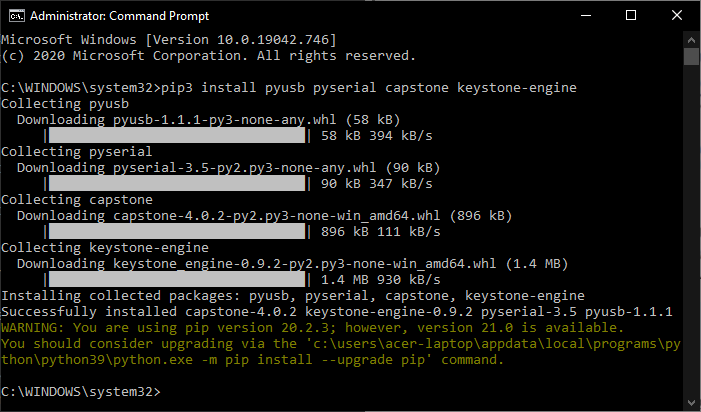
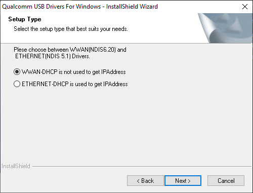
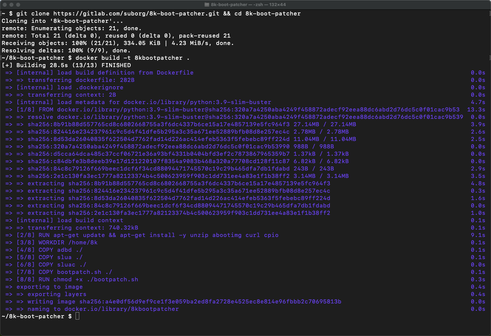
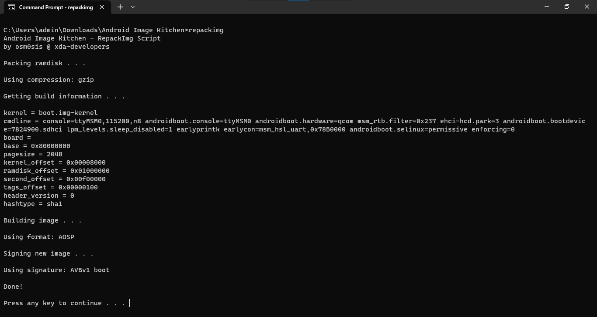
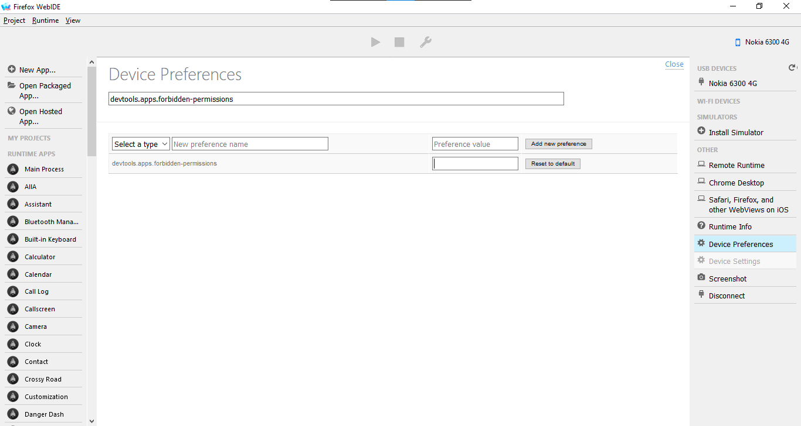

**Table of Contents**
- [Before proceeding: back up your data](#before-proceeding-back-up-your-data)
- [What we’ll need](#what-well-need)
- [Part 1: Set up environment for EDL tools](#part-1-set-up-environment-for-edl-tools)
- [Part 2: Obtaining the boot partition](#part-2-obtaining-the-boot-partition)
	- [Nokia 8000 4G and Nokia 6300 4G with bkerler’s EDL](#nokia-8000-4g-and-nokia-6300-4g-with-bkerlers-edl)
	- [Nokia 2720 Flip and Nokia 800 Tough with andybalholm’s EDL](#nokia-2720-flip-and-nokia-800-tough-with-andybalholms-edl)
- [Part 3: Patching the boot partition](#part-3-patching-the-boot-partition)
	- [Automatic patching with `8k-boot-patcher`](#automatic-patching-with-8k-boot-patcher)
	- [Manual patching with Android Image Kitchen](#manual-patching-with-android-image-kitchen)
- [Part 4: Flashing the modified boot partition](#part-4-flashing-the-modified-boot-partition)

On KaiOS 2.5.4 devices, such as the 6300 4G and 8000 4G, ADB and WebIDE can be used to install most third-party apps. However, apps with special ‘forbidden’ permissions are not allowed, including most BananaHackers apps with `engmode-extension` like Wallace Toolbox, which can be used to gain exclusive access of the phone. You also cannot make changes to the system. On the 2720 Flip and 800 Tough with KaiOS 2.5.2.2, with HMD/Nokia Mobile changing their release branches from `dev-keys` to `release-keys`, the situation is even worse as you cannot sideload at all.

This is because in order for WhatsApp's VoIP feature to work on these KaiOS versions, a security module called SELinux[^4] is now set to be `Enforced` which checks and reverts system modifications on boot. To get total read-write access to the devices, you'll now have to permanently root them by setting SELinux to `Permissive` mode.

The guide below is based on the main guide from BananaHackers website, but has been rewritten to make it easier to follow. The process will take somewhat considerable 30 minutes to an hour, so do this when you have enough time.

> [!IMPORTANT]
> **DISCLAIMER: This process will void your phone's warranty, disable its ability to receive WhatsApp calls and over-the-air updates, but you can undo this if you save a copy of the original boot partition. However, you might also brick your phone if you make a mistake in the process, so proceed at your own risk and with caution! I won't be responsible for any damages done to your phone by following these.**
> 
> Remember, you don't have to root your phone to do things that usually need root access e.g. you can use [this fork of Luxferre's AppBuster] to disable apps from the launcher instead of deleting them with Wallace Toolbox. You can also install [Luxferre's CrossTweak], a Wallace Toolbox alternative also made by Luxferre that does not need `engmode-extension` and therefore can be easily installed on KaiOS 2.5.4 devices.

### Before proceeding: [back up] your data
> [Murphy's Law] states, "Anything that can go wrong, will go wrong". It's a proverb from the late 1940s, and while it may not be as academically accurate and influential as [Newton's laws of motion], it's generally acknowledged in technology as a rule of thumb. Even if you do the best you can, things can unexpectedly go south, so it's always good to prepare for the worst.

- To export your contacts from the built-in Contacts app, go to *Contacts → Options → Settings → Export contacts*. From there, choose to either save to a CSV file on your SD card, send through Bluetooth to other devices, or upload to Web services such as Google Contacts and Microsoft Outlook.
	- You can also use third-party backup services and tools such as [PhoneCopy in KaiStore] or D3SXX's [kaios-backup] etc.
- On debug-enabled devices, you can sideload `certified` apps such as D3SXX's [kaios-backup] or Fiachra1993's [kaios-sms-backup], which uses Firefox OS APIs to export your text messages to JSON or CSV files.
- Built-in Calendar app allows syncing events through Google, ActiveSync or CalDAV accounts. If you only have a small number of events, you can migrate each of those to your online calendars. strukturart's [greg] also allows syncing events with Nextcloud.
- Each entry in the Notes app can be shared over texts, Bluetooth or email.
- On internal storage or SD card (whichever you chose under *Settings → Storage → Default media location*), captured photos and videos are stored under `DCIM`; whereas recorded voice files are stored under `audio`.
	- To get your phone to show up on the computer as external storage, turn on *USB Storage* under *Settings → Storage*.

For backing up application data (excluding WhatsApp chats), system preferences and partition images, see [Back up system partitions].

### What we'll need
- a Nokia 6300 4G (excl. TA-1324), 8000 4G, 2720 Flip, 800 Tough or Alcatel Go Flip 3;
- an USB cable capable of data transferring (EDL cables work as well);
- MBN firehose programmer file: [8000 4G and 6300 4G], [2720 Flip], [800 Tough] or Go Flip 3 ([AT&T/Cricket], [T-Mobile/Metro/Rogers]);
- EDL utility to read and write system partitions: [bkerler's edl.py v3.1] for 8000 4G/6300 4G, [andybalholm's edl] for 2720 Flip/800 Tough/Go Flip 3;
- required for 6300 4G/8000 4G: [Gerda Recovery image file] ([backup]) for the Nokia 8110 4G, since the firehose loader above has a reading bug, we'll use this to access ADB from Recovery mode and get the boot partition from there;
- Python and `pip` for `edl.py` to work (setup guide can be found for each OS below);
	- Don't have an Internet connection? Download and install manually from PyPI: [pyusb], [pyserial], [keystone-engine], [capstone], [docopt]
- [Android Debug Bridge (ADB)] to read the boot image in Gerda Recovery (see [Sideloading and debugging/WebIDE])
- Windows: Qualcomm driver to contact the phone in EDL mode (included in the `edl.py` package)
- Windows: latest version of [Zadig] to configure `libusb-win32` driver; do NOT use the older version bundled as it has less chances of success
- macOS: [Homebrew] to quickly set up Python, ADB, `libusb` and configure the environment for EDL tools (setup guide can be found below)
	- *Python 2.7 bundled with macOS 10.8 to 12 is NOT recommended for following this guide.*
- **If you're going the automatic boot partition patching and compilation via Docker route (only recommended for 5-6 year old computers):**
	- [Git] to clone/download the repository of the patcher tool to your computer;
	- Docker Compose to provide the environment for the patcher tool to work (included in [Docker Desktop])
	- Windows: WSL2 with [Linux kernel update package] installed (to install WSL2, turn on Virtualization in BIOS, then open Command Prompt with administrative rights and type `wsl --install`)
- **If you're going the extracting and manual editing by hand route:**
	- Android Image Kitchen v3.8 ([Windows], [macOS/Linux])
	- on Windows 10 pre-1809: [Notepad++] to edit files while [preserving line endings]
	- (optional) [Java Runtime Environment] to properly sign the boot image with AVBv1

andybalholm's EDL cannot be used on 8000 4G and 6300 4G due to structural changes within GPT, which will result in an error `AttributeError: 'gpt' object has no attribute 'partentries'. Did you mean: 'num_part_entries'?`. **Do note that the command structures used between bkerler's and andybalholm's are different, which we'll mention below.**

For the sake of convenience, move the Gerda Recovery image and the MBN file into the root of `edl-3.1` or `edl-master` folder. If you need to have those in other folders, change the directory path accordingly.

*If you're on Linux, Python and ADB can be quickly set up by installing with your built-in package manager. We won't be covering this here, as each Linux distro has its own way of installing from package manager.*

> Note for Arch Linux users: I've made an experimental `root.sh` that you can use to automate all 4 parts of the process (see the root of the repository) based on @Llixuma's tutorial. Debian-based distro users stay tuned!

### Part 1: Set up environment for EDL tools
*This portion of the guide was taken from [Development/EDL tools on BananaHackers Wiki] so that you don't have to switch tabs. Kudos to Cyan for the guides!*

#### Linux
1. Install Python from your operating system's package manager e.g.
```console
sudo apt-get install python pip3
```
2. Then, open Terminal and type this to install the dependencies for EDL tools:
```console
sudo -H pip3 install pyusb pyserial capstone keystone-engine docopt
```
3. Switch your phone to EDL mode and connect it to your computer. Either:
	- if your phone is on, turn on debugging mode on your phone by dialing `*#*#33284#*#*`, connect it to your computer and type `adb reboot edl` in a command-line window.
	- if your phone is off, hold down `*` and `#` at the same time while inserting the USB cable to the phone.

In both cases, the phone's screen should blink with a 'enabled by KaiOS' logo then become blank. This is normal behaviour letting you know you're in EDL mode and you can proceed.

Additionally, if you have issue with device access:
- Open `/etc/modprobe.d/blacklist.conf` in a text editor and append `blacklist qcserial`.
- Copy both `51-edl.rules` and `50-android.rules` in the root of extracted EDL tools folder to `/etc/udev/rules.d`.

#### macOS
1. Follow the instructions to install [Homebrew] on its homepage. Basically just open Terminal and copy the long streak of code shown on the page, and type your password when prompted.

2. While you're in Terminal, type this into the command-line:
```console
brew install python android-platform-tools libusb && pip3 install pyusb pyserial capstone keystone-engine docopt
```
3. Switch your phone to EDL mode and connect it to your computer. Either:
	- if your phone is on, turn on debugging mode on your phone by dialing `*#*#33284#*#*`, connect it to your computer and type `adb reboot edl` in a command-line window.
	- if your phone is off, hold down `*` and `#` at the same time while inserting the USB cable to the phone.

In both cases, the phone's screen should blink with a 'enabled by KaiOS' logo then become blank. This is normal behaviour letting you know you're in EDL mode and you can proceed.

#### Windows
1. Head over to [Python's official download page for Windows] and download the correct installer for your architecture, or download the latest version of Python from [Microsoft Store]. If you're downloading from Microsoft Store, skip to step 4.
2. Proceed with installing Python as usual. If you choose to customize your installation, include `pip`. Don't forget to tick the box next to "Add Python to PATH" to add Python as a global [environment variable], otherwise you'll have a hard time using Python to run scripts later on.
	- If you decide to customize your installation, choose to install `pip` and tick *Add Python to environment variables*.
<p align="center">
	
</p>

3. On Windows 10/11, typing `python` or `python3` within Command Prompt/Windows Terminal will run the Microsoft Store version of Python. To override this default into running the locally installed version, toggle off App Installer (python.exe) and App Installer (python3.exe) under: 
	- Windows 10: Settings → Apps → [Apps & features] → App execution aliases
	- Windows 11: Settings → Apps → Advanced app settings → App execution aliases


4. Open Command Prompt/Windows Terminal with administrator privileges and run this command to install the required dependencies for EDL:
```console
pip3 install pyusb pyserial capstone keystone-engine docopt
```


5. Extract the previously downloaded EDL package, open Drivers, Windows and run `Qualcomm_Diag_QD_Loader_2016_driver.exe` with administrator rights. Proceed with installation and leave everything as default, restart the computer if it prompts you to do so. 
<p align="center">
	
</p>

6. Switch your phone to EDL mode and connect it to your computer. Either:
	- if your phone is on, turn on debugging mode on your phone by dialing `*#*#33284#*#*`, connect it to your computer and type `adb reboot edl` in a command-line window.
	- if your phone is off, hold down `*` and `#` at the same time while inserting the USB cable to the phone.

In both cases, the phone's screen should blink with an 'enabled by KaiOS' logo then become blank. This is normal behaviour letting you know you're in EDL mode and you can proceed.

7. To replace the installed `qcusbser` driver with `libusb-win32` for use with edl.py, download and open [Zadig] (do NOT use the version included in the EDL package). Tick Options, List All Devices and select `QHSUSB__BULK` (your device in EDL mode) in the main dropdown menu. In the target driver box—to which the green arrow is pointing—click the up/down arrows until you see `libusb-win32` and then click Replace Driver.
<p align="center">
	
</p>

> [!NOTE]
> Windows will automatically create restore points on driver installation, as Zadig suggests in its tooltips. On older PCs, this might cause issues with driver configuration process being lengthened past the 5-minute mark. If Zadig aborts the process and hangs, kill Zadig with Task Manager, remove and re-insert the battery on the phone to exit and re-enter EDL mode, then try to install again.

8. If you're configuring the driver for the first time, an "USB Device Not Recognised" pop-up may appear. Exit EDL mode by removing and re-inserting the battery, then turn on the phone in EDL mode again.

### Part 2: Obtaining the boot partition
#### Nokia 8000 4G and Nokia 6300 4G with bkerler's EDL
> Beware: due to the firehose loader being malfunctioned, the EDL tool only accepts one command each session, after which you'll have to disconnect the phone and restart the phone in EDL mode. If you try to throw a second command, it'll result in a `bytearray index out of range` error.

1. Turn on the phone in EDL mode.
2. Open the extracted EDL folder in a command-line shell. Flash the Gerda Recovery image to the recovery partition by typing:
```console
python edl.py w recovery recovery-8110.img --loader=8k.mbn
```
*If the progress bar stops at 99% (not earlier) and you get error `'usb.core.USBError: [Errno None] b'libusb0-dll:err [_usb_reap_async] timeout error\n'` or `usb.core.USBError: [Errno 60] Command timed out`, this is false. Don't mind the error and proceed with the next step.*

3. When finished, disconnect the phone from your computer and exit EDL mode by removing and re-inserting the battery.
4. Then, hold down the top Power button and `*` to turn on the phone in recovery mode. Connect the phone to your computer again.

> [!WARNING]
> Be careful not to boot into system at this point! As stated above, while SELinux is still in `Enforced` mode, it'll try to revert all system modifications on startup, in this case, the custom recovery image we've just flashed will be overwritten by the stock one. If you accidentally start into normal mode (with the usual Nokia chime), you'll have to start over from step 1.

Don't worry if this boots into a white screen: this is because the display driver for the Nokia 8110 4G included in the recovery image are not compatible with the display of 8000 4G/6300 4G.

Check if ADB can recognise the phone by typing `adb devices` into the command-line.

5. Navigate the command-line to the extracted `platform-tools` folder (if needed) and pull the boot image from the phone to the current directory on your computer with ADB by typing:
```console
adb pull /dev/block/bootdevice/by-name/boot boot.img
```
You should now see `/dev/block/bootdevice/by-name/boot: 1 file pulled, 0 skipped.` and have a copy of the boot partition with the size of 32.0MB (32,768KB). Fetched boot image will be saved to the current directory.

6. Reboot the phone into normal mode by typing `adb reboot` into the command-line, or remove and re-insert the battery. Our custom Gerda Recovery partition will now be overwritten by the default one.

You can disconnect the phone from your computer for now.

#### Nokia 2720 Flip and Nokia 800 Tough with andybalholm's EDL
Unlike the 6300 4G and 8000 4G, our phones' EDL loader properly works with both reading and writing, so the steps are more straightforward.

1. Switch your phone to EDL mode and connect it to your computer. Either:
	- if your phone is on, turn on debugging mode on your phone by dialing `*#*#33284#*#*`, connect it to your computer and type `adb reboot edl` in Command Prompt/Terminal;
	- if your phone is off, hold down both volume keys on the side (2720 Flip) or both D-Pad Up and Down keys (800 Tough) at the same time while inserting the USB cable to the phone.
	
In both cases, the phone's screen should blink with a 'Powered by KaiOS' logo then go blank. This is normal behaviour letting you know you're in EDL mode and you can proceed.

2. Open the extracted EDL folder in a command-line shell. Extract the boot partition of the phone to the current directory on your computer by typing either of these commands depending on which file you have:
```console
python edl.py -r boot boot.img -loader 2720.mbn
```
```console
python edl.py -r boot boot.img -loader 800t.mbn
```
3. When finished, reboot the phone into normal operation by typing either of these into the command-line, or remove and re-insert the battery:
```console
python edl.py -reset -loader 2720.mbn
```
```console
python edl.py -reset -loader 800t.mbn
```
You can disconnect the phone from your computer for now.

> [!WARNING]
> **Copy and keep the original boot partition somewhere safe in case you need to restore to the original state for over-the-air updates or re-enabling WhatsApp calls.**

### Part 3: Patching the boot partition
#### Automatic patching with `8k-boot-patcher`
1. Download and install [Docker Desktop]. Once set up, open the program, click Accept on this box and let the Docker Engine start before exiting.


2. Use [Git] to clone/download the boot patcher toolkit by typing this into Command Prompt/Terminal. This will download the toolkit and have Docker set it up. Do not omit the dot/period at the end of this command, this tells Docker where our downloaded toolkit are located on the system.
```console
git clone https://gitlab.com/suborg/8k-boot-patcher.git && cd 8k-boot-patcher && docker build -t 8kbootpatcher .
```


3. Copy the `boot.img` file we've just pulled from our phone to the desktop and do not change its name. Type this into Command Prompt/Terminal to run the patching process:
	- Windows: `docker run --rm -it -v %cd%/Desktop:/image 8kbootpatcher`
	- macOS/Linux: `docker run --rm -it -v ~/Desktop:/image 8kbootpatcher`
```console
$ docker run --rm -it -v ~/Desktop:/image 8kbootpatcher

Boot image found, patching...
writing boot image config in bootimg.cfg
extracting kernel in zImage
extracting ramdisk in initrd.img
charger
data
[...]
ueventd.qcom.rc
ueventd.rc
verity_key
4037 blocks
4979 blocks
reading config file bootimg.cfg
reading ramdisk from myinitrd.img
Writing Boot Image boot.img
Boot image patched!
```
That's it! On your desktop there will be two new image files, the modified `boot.img` and the original `boot-orig.img`. You can now head to [part 4].


#### Manual patching with Android Image Kitchen
1. Extract the Android Image Kitchen tools and copy the boot image we've just obtained over to the root of the extracted folder.


2. Open the folder in Command Prompt/Terminal and type `unpackimg boot.img`. This will split the image file and unpack the ramdisk to their subdirectories.


> [!WARNING]
> **Be sure to edit the files correctly, else the phone won't boot!**

3. Let the editing begin! First, open `ramdisk/default.prop` using Notepad++ and change:
	- line 7: `ro.secure=1` → `ro.secure=0`
	- line 8: `security.perf_harden=1` → `security.perf_harden=0`
	- line 10: `ro.debuggable=0` → `ro.debuggable=1`

```diff
@@ -4,9 +4,9 @@
  ro.sw.release.date=21-08-13
  ro.build.version.fih=20.00.17.01
  ro.build.elabel=false
- ro.secure=1
- security.perf_harden=1
+ ro.secure=0
+ security.perf_harden=0
  ro.allow.mock.location=0
- ro.debuggable=0
+ ro.debuggable=1
  ro.adb.secure=0
  ro.zygote=zygote32
```
<p align="center">
	
</p>

4. Open `ramdisk/init.qcom.early_boot.sh` in Notepad++ and add `setenforce 0` as a new line at the end of the file.
```diff
@@ -312,14 +312,14 @@
  else
      # nand configuration
      if [ -e $nand_file ]
      then
          if grep ${partition_name} $nand_file
          then
              gps_enabled=false
          fi
      fi
  fi

  setprop ro.gps.enabled $gps_enabled
+ setenforce 0

```
<p align="center">
	
</p>

5. Go back to the root Android Image Kitchen folder and open `split_img/boot.img-cmdline` in Notepad++. Without adding a new line, scroll to the end of the first line and append `androidboot.selinux=permissive enforcing=0`.


6. Open `ramdisk/init.rc` (NOT `ramdisk/init`) and delete line 393 `setprop selinux.reload_policy 1` or mark a comment as shown. This will ultimately prevent SELinux from overwriting the policy changes we made above.

*If you want to know why I put an additional line to set `/sys/module/lowmemorykiller/parameters/enable_lmk` to 0, see [Expanding RAM with swapfile].*

```diff
@@ -390,7 +390,6 @@
  setusercryptopolicies /data/user

  # Reload policy from /data/security if present.
- setprop selinux.reload_policy 1

  # Set SELinux security contexts on upgrade or policy update.
  restorecon_recursive /data
@@ -418,9 +418,10 @@
  # Memory management.  Basic kernel parameters, and allow the high
  # level system server to be able to adjust the kernel OOM driver
  # parameters to match how it is managing things.
+ write /sys/module/lowmemorykiller/parameters/enable_lmk 0
  write /proc/sys/vm/overcommit_memory 1
  write /proc/sys/vm/min_free_order_shift 4
  chown root system /sys/module/lowmemorykiller/parameters/adj
  chmod 0664 /sys/module/lowmemorykiller/parameters/adj
  chown root system /sys/module/lowmemorykiller/parameters/minfree
  chmod 0664 /sys/module/lowmemorykiller/parameters/minfree
```


7. And that's a wrap! Open the root Android Image Kitchen folder in a command-line window and type `repackimg` to package our modified boot partition.

<!--  -->



*If you happen to encounter an error during the signing process, that's likely because the process uses `java` to power the `boot-signer.jar` sequence and you don't have it installed. The image will still be packaged and ready for flashing, but if you're a perfectionist, you can install JRE and try again.*

If the newly packaged image is barely over 1/3 the size of the original image, it's a normal behaviour and you can proceed.

### Part 4: Flashing the modified boot partition
1. Turn on your phone in EDL mode and connect it to your computer.
2. Move the newly created `boot.img`, `unsigned-new.img` or `image-new.img` to the EDL tools folder and open Command Prompt/Terminal within it. From here type either of these commands depending on which image file you have:
```console
python edl.py w boot boot.img --loader=8k.mbn
```
```console
python edl.py w boot unsigned-new.img --loader=8k.mbn
```
```console
python edl.py w boot image-new.img --loader=8k.mbn
```
For Nokia 2720 Flip and Nokia 800 Tough with andybalholm's EDL:
```console
python edl.py -w boot boot.img -loader 2720.mbn
```
```console
python edl.py -w boot boot.img -loader 800t.mbn
```
*Again, if the progress bar stops at 99% and you get a timeout error, this is because the phone doesn't send any indicator information back to the EDL tool when in fact the image has been successfully written. Don't mind the error and go on with the next step.*

3. Restart the phone to normal operation mode by typing `python edl.py reset`. And we're done!

#### Next steps
- Now that you've rooted your phone, to install applications with 'forbidden' permissions, connect your phone to a WebIDE session, open Device Preferences in the right pane, clear the value of `devtools.apps.forbidden-permissions`, then restart B2G by either reboot the phone or hold the top Power button and select *Memory Cleaner, Deep Clean Memory*.



- If you wish to retain privileged permissions after restoring the phone to its unrooted state, before doing so, back up all data, sideload [Luxferre's CrossTweak] then press # to perform a privileged factory reset — this will wipe all data of the phone and let you set up with a privileged session. This session will last until an OTA update overrides or you choose to factory reset normally yourself.
- After rooting, you can spoof SELinux's Enforced status for WhatsApp VoIP by typing these commands one-by-one into the rooted ADB shell. This will last until a restart.
```console
echo -n 1 > /data/enforce
mount -o bind /data/enforce /sys/fs/selinux/enforce
```

If you wish to revert all changes you've made, connect your phone to the computer in EDL mode, move the original boot image file to `edl-3.1` or `edl-master` folder, open Command Prompt/Terminal within the folder and type:
```console
python edl.py w boot boot.img --loader=8k.mbn
python edl.py reset
```