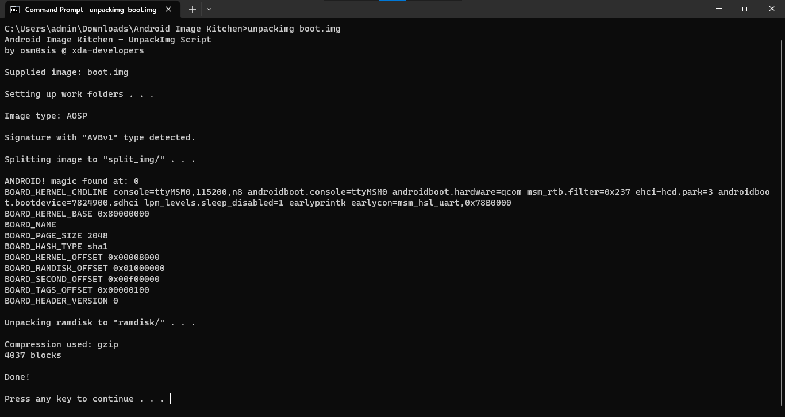
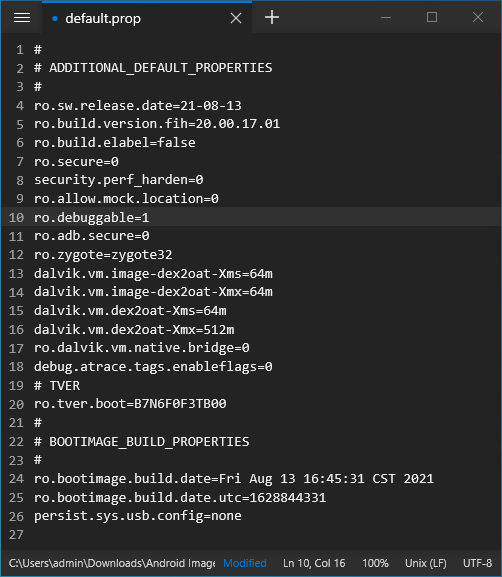

On the Nokia 6300 4G and 8000 4G, although you can use ADB and DevTools to install most applications outside KaiStore, you aren't allowed to install apps with 'forbidden' permissions such as `embed-apps`, `embed-widget` and `engmode-extension` (defined by the `devtools.apps.forbidden-permissions` Device Preferences flag). Wallace Toolbox and a number of apps made by BananaHackers depend on this permission to gain special control of the system, which naturally means you cannot sideload and use them on the 6300 4G and 8000 4G. Most system modifications have also been blocked, and if you were to make any changes, they would be reverted upon next boot.

That's because in order for VoIP in WhatApp to work on newer KaiOS versions, a kernel security module called [SELinux] is now set to Enforcing mode. In this mode, SELinux checks for, and denies any actions, both made by the user and system, which are not permitted in its configured set of rules. To root, you need to edit the boot partition, set SELinux to Permissive mode, and change certain boot flags to allow system-level debugging access.

Do give yourself enough time to progress through this guide; it will take somewhat considerable 30 minutes to an hour.

### Before proceeding
PROCEED WITH CAUTION AND AT YOUR OWN RISK. I wrote this guide "as-is" with no guarantees or warranties. HMD does not explicitly cover software modifications under its warranty policy, so you should assume that rooting your phone will void its warranty.

Proceeding with this guide will set SELinux to Permissive mode, which in turn disable voice calls in WhatsApp, and may prevent you from receiving incremental over-the-air updates. If you keep a copy of the original boot image, you can overwrite the modified partition and revert all changes, which I will cover in the last portion of the guide. Nonetheless, you can still brick your phone if you make any mistake in the process.

In most situations, you don't have to root your phone to remove apps or change settings, e.g. you can use [this fork of Luxferre's AppBuster] to hide apps from the launcher, instead of deleting them with Wallace Toolbox. You can also install [CrossTweak], a Wallace Toolbox alternative which doesn't need `engmode-extension` and therefore can be installed on KaiOS 2.5.4 phones.

### What we need
- a Nokia 6300 4G (excl. TA-1324), Nokia 8000 4G, Nokia 2720 Flip, Nokia 800 Tough or Alcatel Go Flip 3;
- an USB cable capable of transferring data (EDL cables should also work);
- EDL programmer for your phone (in MBN format): [6300 4G and 8000 4G], [2720 Flip], [800 Tough] or Go Flip 3 ([AT&T/Cricket], [T-Mobile/Metro/Rogers]);
- `edl.py` to read and write system partitions in EDL mode: [bkerler's edl] for the 6300 4G and 8000 4G, and [andybalholm's edl] for the 2720 Flip, 800 Tough and Go Flip 3;
	- I won't cover QFIL or Qualcomm Product Support Tools (QPST) here; however if you're more familiar with them, you can use them as well
- required for the 6300 4G and 8000 4G: [Gerda Recovery image file] (backup: [one], [two]) for the Nokia 8110 4G; since the programmer above has a reading bug, we'll use this to access ADB from Recovery mode and get the boot partition from there;
- Python 3 and `pip` for `edl.py` to work; setup guide can be found for each OS below
  - *Python 2.7 bundled with macOS 10.8 to 12 is NOT recommended for following this guide.*
  - If you don't have an Internet connection, download and install packages manually from PyPI: [pyusb], [pyserial], [keystone-engine], [capstone], [docopt], [setuptools]
- [Android Debug Bridge (ADB)] to read the boot image in Gerda Recovery (see [Sideloading and debugging third-party applications] for instructions on using ADB)

For the sake of convenience, move the Gerda Recovery image and the MBN file into the root of `edl-3.1` or `edl-master` folder. If you need to have those in other folders, change the directory path for each command in this guide accordingly.

*On macOS and Linux, you can use [Homebrew] or your package manager of choice to quickly set up Python, ADB, `libusb` and configure the environment for `edl.py`; setup guide for macOS will be covered as part of the guide.*

*Windows users also need to download and install:*
- Qualcomm driver for your computer to detect the phone in EDL mode (included in the `edl.py` package)
- latest version of [Zadig] to configure `libusb-win32`/`libusb0` driver; do NOT use the older version bundled in `edl.py` package as it has less chances of success

**If you're going the Automatic patching with 8k-boot-patcher route (only recommended for 5-6 year old computers):**
- [Git] to clone/download the repository of the patcher tool to your computer;
- Docker Compose to provide the environment for the patcher tool to work (included in [Docker Desktop])
- Windows: 2nd version of Windows Subsystem for Linux with [Linux kernel update package] installed (to install WSL2, turn on VT-x virtualization in BIOS, then open Command Prompt with administrative rights and type `wsl --install`)

**If you're going the Manual patching with Android Image Kitchen route:**
- Android Image Kitchen v3.8 ([Windows], [macOS/Linux])
- on Windows 10 pre-1809 and older versions of Windows: [Notepad++] to edit files while [preserving line endings]
- (optional) [Java Runtime Environment] to properly sign the boot image with AVBv1

andybalholm's EDL cannot be used on 8000 4G and 6300 4G due to structural changes within GPT, which will result in an error `AttributeError: 'gpt' object has no attribute 'partentries'. Did you mean: 'num_part_entries'?`. **Do note that the command structures used between bkerler's and andybalholm's edl.py are different, which will be covered in the guide below.**

> Note for Arch Linux users: I've made an experimental `root.sh` that you can use to automate all 4 parts of the process (see the root of the repository) based on @Llixuma's tutorial. Debian-based distro users stay tuned!

### Part 1: Set up environment for EDL tools
*If you were following an older revision of this guide and are stuck at `ModuleNotFoundError: No module named 'distutils'`: starting with Python 3.12, `distutils`, which is a dependency of `capstone`, has been deprecated and removed (mentioned in Python documentation page [What's New In Python 3.10]). It's now superceded by the third-party `setuptools`, which you can install from PyPI with `pip3 install setuptools`.*

#### Linux
Open a shell prompt and install Python and `pip3` from your package manager of choice, then install the dependencies for `edl.py` from PyPI:
- Debian/Ubuntu-based distros: `sudo apt-get install python pip3 android-sdk-platform-tools`
- Fedora, CentOS, RHEL: `sudo dnf install python python3-pip android-tools`
- Arch-based distros: `sudo pacman -S python python-pip android-tools`

```
sudo -H pip3 install pyusb pyserial capstone keystone-engine docopt setuptools
```

Switch your phone to EDL mode and connect it to your computer. Either:
- if your phone is on, dial `*#*#33284#*#*` to turn on debugging mode, connect it to your computer and type `adb reboot edl` in the shell prompt.
- if your phone is off, press and hold `*` and `#` at the same time while inserting the USB cable to the phone.

In both cases, the screen should blink with an 'enabled by KaiOS' logo then become blank. This is normal behaviour letting you know you're in EDL mode and can proceed. If you have any issues with accessing the phone on Debian/Ubuntu-based distros, append `blacklist qcserial` in `/etc/modprobe.d/blacklist.conf` and copy `51-edl.rules` and `50-android.rules` from the Drivers folder (root of EDL directory if you have andybalholm's `edl.py`) to `/etc/udev/rules.d`:

```
# echo "blacklist qcserial" > /etc/modprobe.d/blacklist.conf
```
```
# cp 51-edl.rules 50-android.rules /etc/udev/rules.d
```

#### macOS
Follow the instructions to install [Homebrew] on its homepage, install Android SDK Platform Tools package, latest Python, `libusb` and dependencies for `edl.py` from PyPI. Basically open Terminal and copy-paste each line of this code, and type your password when prompted:

```
/bin/bash -c "$(curl -fsSL https://raw.githubusercontent.com/Homebrew/install/HEAD/install.sh)"
```
```
brew install python android-platform-tools libusb
```
```
pip3 install pyusb pyserial capstone keystone-engine docopt setuptools
```

Switch your phone to EDL mode and connect it to your computer. Either:
- if your phone is on, dial `*#*#33284#*#*` to turn on debugging mode, connect it to your computer and type `adb reboot edl` in Terminal.
- if your phone is off, press and hold `*` and `#` at the same time while inserting the USB cable to the phone.

In both cases, the screen should blink with an 'enabled by KaiOS' logo then become blank. This is normal behaviour letting you know you're in EDL mode and can proceed.

#### Windows
1. Head over to [Python's official download page for Windows] and download the correct installer for your architecture (if you're in doubt select amd64/x86_64), or download the latest version of Python from [Microsoft Store]. If you're downloading from Microsoft Store, skip to step 4.
2. Proceed with installing Python as usual. If you choose to customise your installation, include `pip` and tick *Add Python to environment variables*. Don't forget to tick the box next to "Add python.exe to PATH" to add Python as a global [environment variable], otherwise you'll have a hard time using Python to run scripts later on.


3. On Windows 10/11, typing `python` or `python3` within Command Prompt/Windows Terminal will run the Microsoft Store version of Python. To override this default into running the locally installed version, toggle off App Installer (python.exe) and App Installer (python3.exe) under: 
	- Windows 10: Settings &rarr; Apps &rarr; [Apps & features] &rarr; App execution aliases
	- Windows 11: Settings &rarr; Apps &rarr; Advanced app settings &rarr; App execution aliases


4. Open Command Prompt/Windows Terminal with administrator rights and install the dependencies for `edl.py` from PyPI:

```
pip3 install pyusb pyserial capstone keystone-engine docopt setuptools
```


5. Extract the previously downloaded `edl.py` package, open Drivers, Windows and run `Qualcomm_Diag_QD_Loader_2016_driver.exe` with administrator rights. Proceed with installation and leave everything as default, restart the computer if it prompts you to do so. 


6. Switch your phone to EDL mode and connect it to your computer. Either:
	- if your phone is on, dial `*#*#33284#*#*` to turn on debugging mode, connect it to your computer and type `adb reboot edl` in Command Prompt/Windows Terminal.
	- if your phone is off, press and hold `*` and `#` at the same time while inserting the USB cable to the phone.

In both cases, the screen should blink with an 'enabled by KaiOS' logo then become blank. This is normal behaviour letting you know you're in EDL mode and can proceed.

7. To replace the installed `qcusbser` driver with `libusb-win32` for use with `edl.py`, download and open [Zadig] (do NOT use the version included in the EDL package). Tick Options, List All Devices and select `QHSUSB__BULK` (your device in EDL mode) in the main dropdown menu. In the target driver box, which the green arrow is pointing to, click the up/down arrows until you see `libusb-win32 (v1.2.7.3)` or `libusb0 (v1.2.5.0)`, then click Replace Driver.


> [!NOTE]
> Windows will automatically create restore points on driver installation, as Zadig suggests in its tooltips. On older computers, this might cause issues with driver configuration process being lengthened past the 5-minute mark. If Zadig aborts the process and hangs, kill Zadig with Task Manager, remove and re-insert the battery on the phone to exit and re-enter EDL mode, then try to install again. (seems to be improved with Zadig 2.9)

8. If you're configuring the driver for the first time, an "USB Device Not Recognised" pop-up may appear. Exit EDL mode by removing and re-inserting the battery, then turn on the phone in EDL mode again.

### Part 2: Obtaining the boot partition
#### Nokia 8000 4G and Nokia 6300 4G with bkerler's EDL
> Beware: due to the firehose loader being malfunctioned, `edl.py` only accepts one command each session, after which you'll have to disconnect the phone and restart the phone in EDL mode. If you try to execute a second command, it will result in a `bytearray index out of range` error.

1. Turn on the phone in EDL mode.

2. Open the extracted EDL folder in Command Prompt/Terminal. Flash the Gerda Recovery image to the recovery partition by typing:

```
python edl.py w recovery recovery-8110.img --loader=8k.mbn
```

*If the progress bar stops at 99% (not earlier) and you get error `'usb.core.USBError: [Errno None] b'libusb0-dll:err [_usb_reap_async] timeout error\n'` or `usb.core.USBError: [Errno 60] Command timed out`, don't mind the error and proceed with the next step.*

3. When finished, disconnect the phone from your computer and exit EDL mode by removing and re-inserting the battery.

4. Then, hold down the top Power button and * to turn the phone on in recovery mode. Connect the phone to your computer again.

> [!WARNING]
> Be careful not to boot into system at this point! While SELinux is still in `Enforced` mode, it will try to run `/system/bin/install-recovery.sh` and revert all system modifications on boot, in this case, the custom recovery image we've just flashed will be overwritten by the stock one. If you accidentally start into normal mode (with the usual Nokia chime), you'll have to start over from step 1.

Don't worry if this boots into a white screen: this is because the display driver for the Nokia 8110 4G included in the recovery image are not compatible with the display of 8000 4G/6300 4G. Check if ADB can recognise the phone by typing `adb devices` into Command Prompt/Terminal.

5. Navigate the shell prompt to the extracted `platform-tools` folder with `cd` (if needed). Pull the boot partition from the phone to your computer with ADB:

```
adb pull /dev/block/bootdevice/by-name/boot boot.img
```

You should now see `/dev/block/bootdevice/by-name/boot: 1 file pulled, 0 skipped.` and have a copy of the boot partition with the size of 32.0 MB (32,768 KB). Fetched boot image will be saved to the current directory.

6. Reboot the phone into normal mode by typing `adb reboot` into Command Prompt/Terminal, or remove and re-insert the battery. Our custom Gerda Recovery partition will now be overwritten by the default one.

Feel free to disconnect the phone from your computer for now.

#### Nokia 2720 Flip and Nokia 800 Tough with andybalholm's EDL
Unlike that of the 6300 4G and 8000 4G, our phones' EDL programmer properly reads and writes from the phone, so the steps are more straightforward.

1. Switch your phone to EDL mode and connect it to your computer. Either:
	- if your phone is on, dial `*#*#33284#*#*` to turn on debugging mode, connect it to your computer and type `adb reboot edl` in Command Prompt/Terminal;
	- if your phone is off, hold down both volume keys on the side (2720 Flip) or both D-Pad Up and Down keys (800 Tough) at the same time while inserting the USB cable to the phone.

In both cases, the screen should blink with an 'Powered by KaiOS' logo then go blank. This is normal behaviour letting you know you're in EDL mode and can proceed.

2. Extract the EDL package and open the folder in Command Prompt/Terminal. Pull the boot partition of the phone to the current directory on your computer by typing either of these commands, depending on which phone you have:

```
python edl.py -r boot boot.img -loader 2720.mbn
```
```
python edl.py -r boot boot.img -loader 800t.mbn
```

3. When finished, reboot the phone into normal mode by typing `python edl.py -reset` into Command Prompt/Terminal, or remove and re-insert the battery.

You should now have a copy of the boot partition with the size of 25.0 MB (25,600 KB). Feel free to disconnect the phone from your computer for now.

> [!WARNING]
> **Copy and keep the original boot partition somewhere safe in case you need to restore the phone to the original state to do over-the-air updates or re-enable WhatsApp calls.**

### Part 3: Patching the boot partition
#### Automatic patching with `8k-boot-patcher` 
1. Download and install [Docker Desktop]. Once set up, open the program, click Accept on this box and let the Docker Engine start before exiting.


2. Use [Git] to clone/download the boot patcher toolkit by typing this into Command Prompt/Terminal. This will download the toolkit and have Docker set it up. Do not omit the dot/period at the end of this command, this tells Docker where our downloaded toolkit are located on the system.

```
git clone https://gitlab.com/suborg/8k-boot-patcher.git && cd 8k-boot-patcher && docker build -t 8kbootpatcher .
```


3. Copy the `boot.img` file you just pulled from your phone to the desktop and do NOT change its name. Type this into Command Prompt/Terminal to run the patching process:
	- Windows: `docker run --rm -it -v %cd%/Desktop:/image 8kbootpatcher`
	- macOS/Linux: `docker run --rm -it -v ~/Desktop:/image 8kbootpatcher`

```console
$ docker run --rm -it -v ~/Desktop:/image 8kbootpatcher
Boot image found, patching...
writing boot image config in bootimg.cfg
extracting kernel in zImage
extracting ramdisk in initrd.img
charger
data
[...]
ueventd.qcom.rc
ueventd.rc
verity_key
4037 blocks
4979 blocks
reading config file bootimg.cfg
reading ramdisk from myinitrd.img
Writing Boot Image boot.img
Boot image patched!
```

That's it! On your desktop there will be two new image files, the modified `boot.img` and the original `boot-orig.img`. You can now head to [part 4].


#### Manual patching with Android Image Kitchen
1. Extract the Android Image Kitchen package and copy the boot image you just pulled over to the root of the extracted folder.


2. Open the folder in Command Prompt/Terminal and type `unpackimg boot.img`. This will split the image file and unpack the ramdisk to their subdirectories.



> [!WARNING]
> **Be sure to edit the files correctly, else the phone won't boot!**

3. Let the editing begin! First, open `ramdisk/default.prop` using Notepad++ and change:
	- line 7: `ro.secure=1` → `ro.secure=0`
	- line 8: `security.perf_harden=1` → `security.perf_harden=0`
	- line 10: `ro.debuggable=0` → `ro.debuggable=1`

```diff
@@ -4,9 +4,9 @@
  ro.sw.release.date=21-08-13
  ro.build.version.fih=20.00.17.01
  ro.build.elabel=false
- ro.secure=1
- security.perf_harden=1
+ ro.secure=0
+ security.perf_harden=0
  ro.allow.mock.location=0
- ro.debuggable=0
+ ro.debuggable=1
  ro.adb.secure=0
  ro.zygote=zygote32
```



4. Open `ramdisk/init.qcom.early_boot.sh` in Notepad++ and add `setenforce 0` as a new line at the end of the file.

```diff
@@ -312,14 +312,14 @@
  else
      # nand configuration
      if [ -e $nand_file ]
      then
          if grep ${partition_name} $nand_file
          then
              gps_enabled=false
          fi
      fi
  fi

  setprop ro.gps.enabled $gps_enabled
+ setenforce 0

```


5. Go back to the Android Image Kitchen folder and open `split_img/boot.img-cmdline` in Notepad++. Without adding a new line, scroll to the end of the first line and append `androidboot.selinux=permissive enforcing=0`.


6. Open `ramdisk/init.rc` (NOT `ramdisk/init`) and delete line 393 `setprop selinux.reload_policy 1` or mark a comment as shown. This will ultimately prevent SELinux from overwriting the policy changes we made above.

*If you want to know why I put an additional line to set `/sys/module/lowmemorykiller/parameters/enable_lmk` to 0, see [Expanding RAM with swapfile].*

```diff
@@ -390,7 +390,6 @@
  setusercryptopolicies /data/user

  # Reload policy from /data/security if present.
- setprop selinux.reload_policy 1

  # Set SELinux security contexts on upgrade or policy update.
  restorecon_recursive /data
@@ -418,9 +418,10 @@
  # Memory management.  Basic kernel parameters, and allow the high
  # level system server to be able to adjust the kernel OOM driver
  # parameters to match how it is managing things.
+ write /sys/module/lowmemorykiller/parameters/enable_lmk 0
  write /proc/sys/vm/overcommit_memory 1
  write /proc/sys/vm/min_free_order_shift 4
  chown root system /sys/module/lowmemorykiller/parameters/adj
  chmod 0664 /sys/module/lowmemorykiller/parameters/adj
  chown root system /sys/module/lowmemorykiller/parameters/minfree
  chmod 0664 /sys/module/lowmemorykiller/parameters/minfree
```


7. And that's a wrap! Open the Android Image Kitchen folder in Command Prompt/Terminal and type `repackimg` to package your modified boot partition.

<!--  -->


*If you happen to encounter an error during the signing process, that's likely because the process uses `java` to power the `boot-signer.jar` sequence and you don't have it installed. The image will still be packaged and ready for flashing, but if you're a perfectionist, you can install JRE and try again.*

If the new image is barely over 1/3 the size of the original image, it's normal and you can proceed.

### Part 4: Flashing the modified boot partition
1. Turn on your phone in EDL mode and connect it to your computer.

2. Move the newly created `boot.img`, `unsigned-new.img` or `image-new.img` to the EDL folder and open Command Prompt/Terminal within it. From here type either of these commands depending on which image file you have:

```
python edl.py w boot boot.img --loader=8k.mbn
```
```
python edl.py w boot unsigned-new.img --loader=8k.mbn
```
```
python edl.py w boot image-new.img --loader=8k.mbn
```

For Nokia 2720 Flip and Nokia 800 Tough with andybalholm's EDL:

```
python edl.py -w boot boot.img -loader 2720.mbn
```
```
python edl.py -w boot boot.img -loader 800t.mbn
```

*Again, if the progress bar stops at 99% and you get a timeout error, this is because the programmer doesn't send any information back to `edl.py` when the image has been successfully written. Don't mind the error and go on with the next step.*

3. Restart the phone to normal mode by typing `python edl.py reset`. And we're done!

### Next steps
- Now that you've rooted your phone, to install apps with 'forbidden' permissions, connect your phone to a WebIDE session, open Device Preferences in the right pane, clear the value of `devtools.apps.forbidden-permissions`, then restart B2G by either reboot the phone or hold the top Power button and select Memory Cleaner, Deep Clean Memory.


- If you wish to retain privileged permissions after restoring the phone to its unrooted state, before doing so, back up all data, sideload Luxferre's [CrossTweak] then press # to perform a privileged factory reset; this will wipe all data of the phone and let you set up with a privileged user session. This session will last until an OTA update overrides or you choose to factory reset the phone.
- (Proof-of-concept, does NOT work) After rooting, you can spoof SELinux's Enforced status for VoIP in WhatsApp by typing these commands one-by-one into the rooted ADB shell. This will last until a restart.

```
echo -n 1 > /data/enforce
mount -o bind /data/enforce /sys/fs/selinux/enforce
```

If you wish to revert all changes you've made, connect your phone to the computer in EDL mode, move the original boot image file to `edl-3.1` or `edl-master` folder, open Command Prompt/Terminal and type:

```
python edl.py w boot boot.img --loader=8k.mbn
python edl.py reset
```

[SELinux]: https://lineageos.org/engineering/HowTo-SELinux
[this fork of Luxferre's AppBuster]: https://github.com/minhduc-bui1/AppBuster
[CrossTweak]: https://gitlab.com/suborg/crosstweak
[back up your data]: https://github.com/bmndc/nokia-leo/wiki/Backup

[6300 4G and 8000 4G]: https://raw.githubusercontent.com/bmndc/nokia-leo/docs/assets/8k.mbn
[2720 Flip]: https://edl.bananahackers.net/loaders/2720.mbn
[800 Tough]: https://edl.bananahackers.net/loaders/800t.mbn
[AT&T/Cricket]: https://github.com/programmer-collection/alcatel/blob/master/Gflip3_ATT/Gflip3_ATT_NPRG.mbn
[T-Mobile/Metro/Rogers]: https://github.com/programmer-collection/alcatel/blob/master/Gflip3_TMO/Gflip3_TMO_NPRG.mbn
[Gerda Recovery image file]: https://raw.githubusercontent.com/bmndc/nokia-leo/docs/assets/recovery-8110.img
[one]: https://cloud.disroot.org/s/3ojAfcF6J2jQrRg/download
[two]: https://drive.google.com/open?id=1ot9rQDTYON8mZu57YWDy52brEhK3-PGh
[pyusb]: https://pypi.org/project/pyusb/
[pyserial]: https://pypi.org/project/pyserial/
[keystone-engine]: https://pypi.org/project/keystone-engine/
[capstone]: https://pypi.org/project/capstone/
[docopt]: https://pypi.org/project/docopt/
[setuptools]: https://pypi.org/project/setuptools/
[Sideloading and debugging third-party applications]: https://github.com/bmndc/nokia-leo/wiki/Sideloading-and-debugging-third%E2%80%90party-applications
[bkerler's edl]: https://github.com/bkerler/edl/archive/refs/heads/master.zip
[andybalholm's edl]: https://github.com/andybalholm/edl
[Python's official download page for Windows]: https://www.python.org/downloads/windows
[Android Debug Bridge (ADB)]: https://developer.android.com/studio/releases/platform-tools
[Zadig]: https://github.com/pbatard/libwdi/releases/latest
[Homebrew]: https://brew.sh
[Git]: https://git-scm.com/book/en/v2/Getting-Started-Installing-Git
[Docker Desktop]: https://docs.docker.com/compose/install
[Linux kernel update package]: https://learn.microsoft.com/en-us/windows/wsl/install-manual#step-4---download-the-linux-kernel-update-package
[Windows]: https://forum.xda-developers.com/attachments/android-image-kitchen-v3-8-win32-zip.5300919
[macOS/Linux]: https://forum.xda-developers.com/attachments/aik-linux-v3-8-all-tar-gz.5300923
[Notepad++]: https://notepad-plus-plus.org/downloads
[preserving line endings]: https://www.cs.toronto.edu/~krueger/csc209h/tut/line-endings.html
[Java Runtime Environment]: https://www.java.com/en/download
[Customization/Fastboot and EDL on BananaHackers Wiki]: https://wiki.bananahackers.net/guides/edl
[Microsoft Store]: ms-windows-store://publisher/?name=Python%20Software%20Foundation
[environment variable]: https://en.wikipedia.org/wiki/Environment_variable
[Apps & features]: ms-settings:appsfeatures
[What's New In Python 3.10]: https://docs.python.org/3.10/whatsnew/3.10.html#distutils
[part 4]: #part-4-flashing-the-modified-boot-partition